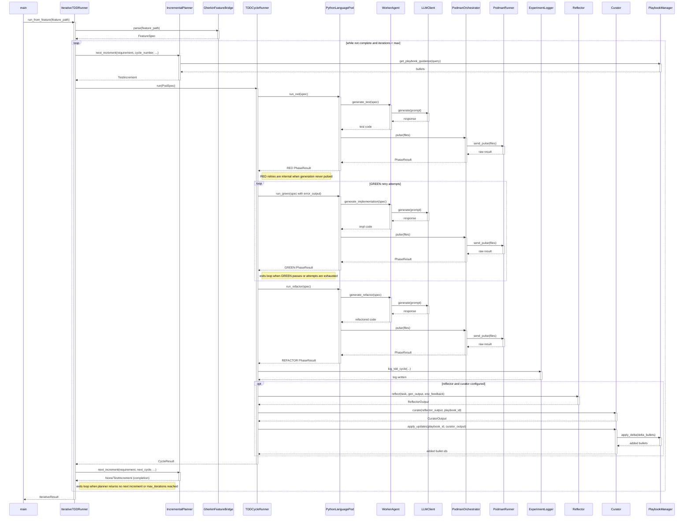

<!-- Generated by generate_live_docs.py on 2026-09-27 07:48 — do not edit by hand -->

# System Architecture

| Component | Module | Role |
|---|---|---|
| LLMClient | src/utils/llm_client.py | Unified provider-agnostic LLM API client supporting OpenRouter, OpenAI, Anthropic, Ollama, DeepSeek. |
| PodmanRunner | src/agents/podman_runner.py | Rootless Podman container runner managing sandbox lifecycle and pulse execution. |
| PodmanOrchestrator | src/agents/podman_orchestrator.py | Stateless sidecar execution layer; hashes workspaces, detects security breaches, maps raw pulses to phase results. |
| PlaybookManager | src/playbook/manager.py | Persistent playbook CRUD, delta bullet application, semantic dedup, token budgets, and safety screening. |
| WorkerAgent | src/agents/worker_agent.py | Builds LLM prompts and extracts code for test/implementation/refactor and SEARCH/REPLACE patches. |
| PythonLanguagePod | src/agents/python_language_pod.py | Executes Python TDD phases with atomic writes, import filtering, sibling-file sharing, and patch escalation. |
| GoLanguagePod | src/agents/go_language_pod.py | Executes Go TDD phases via worker prompts and Podman go test/gosec integration. |
| TypeScriptLanguagePod | src/agents/typescript_language_pod.py | Executes TypeScript TDD phases via vitest in Podman with patch-mode support. |
| SimulationPod | src/agents/simulation_pod.py | Drives PyBullet physics-simulation TDD cycles with oracle execution and attempt archiving. |
| TDDCycleRunner | src/agents/tdd_cycle_runner.py | Orchestrates one RED→GREEN→REFACTOR cycle with retries, abort detection, audit emission, and learning. |
| IterativeTDDRunner | src/agents/iterative_tdd_runner.py | Kent Beck-style outer loop: plan next increment, run a TDD cycle, repeat until planner says complete. |
| IncrementalPlanner | src/agents/incremental_planner.py | Plans the next test increment from existing tests/implementation, Gherkin scenarios, and playbook guidance. |
| PolyglotTDDRunner | src/agents/polyglot_tdd_runner.py | Runs TDD loops across multiple language pods and reports cross-language token efficiency. |
| RedundancyPreChecker | src/agents/redundancy_checker.py | Detects proposed tests that duplicate or are implicitly covered by existing tests before RED. |
| GherkinFeatureBridge | src/agents/gherkin_feature_bridge.py | Parses .feature files into FeatureSpec/ScenarioSpec objects usable by runners and planners. |
| CharacterizationTestGenerator | src/agents/characterization_test_generator.py | Drafts, verifies, and repairs empirical pytest characterization suites against existing code. |
| ExperimentLogger | src/storage/experiment_logger.py | Persists TDD/ML experiment records to PostgreSQL with SQLite fallback. |
| Reflector | src/core/reflector/module.py | Analyzes task outcomes, identifies root causes, correct approaches, code invariants, and bullet tags. |
| Curator | src/core/curator/module.py | Synthesizes reflector output into playbook delta bullets with contradiction/supersede handling. |
| Generator | src/core/generator/module.py | Executes tasks using retrieved playbook bullets and emits trajectory/solution output. |
| BulletRetriever | src/playbook/retrieval.py | Hybrid embedding/keyword retrieval of relevant playbook bullets with context filters. |
| ContextGraphRetriever | src/retrieval/cgr3_retriever.py | CGR³ retrieve-rank-reason pipeline with verdicts and context-gap detection. |
| InstitutionalKnowledgeService | src/retrieval/service.py | Central knowledge service supplying guidance for implementations and anti-patterns. |
| AuditStore | src/audit/store.py | Append-only, hash-chained audit event store with integrity verification. |
| LocalAuditClient | src/audit/local_client.py | SQLite-backed audit client for local/dev hash-chained event emission. |
| PerformanceAggregator | src/broker/performance_aggregator.py | Aggregates audit events into agent/model performance metrics and reliability profiles. |
| AdaptiveBroker | src/broker/adaptive_broker.py | Routes tasks to best model/agent based on learned cost-quality-latency tradeoffs. |
| SuccessRateCalculator | src/analytics/success_rate_calculator.py | Computes experiment success rates by type, playbook version, and time trend. |
| PlaybookReliabilityAnalyzer | src/reliability/playbook_analyzer.py | Measures causal uplift of retrieved bullets on first-pass GREEN outcomes. |
| EnsembleLearner | src/ensemble/learner.py | Orchestrates parallel multi-model learning with voting/deliberation before playbook writes. |
| ProjectBuilder | src/cli/project_builder.py | Drives ModuleArchitect + ModuleTDDBuilder over a project plan, managing build order and assembly. |
| ModuleArchitect | src/contracts/module_architect.py | Generates module-level contracts with shared state, dependencies, and integration tests. |
| ModuleTDDBuilder | src/contracts/module_tdd_builder.py | Builds a module by TDD from its contract, repairing functions and running integration tests. |
| ContractOrchestrator | src/contracts/contract_driven.py | Orchestrates contract-driven development: registers contracts, validates implementations, tracks status. |

```mermaid
sequenceDiagram
    participant Main as main
    participant ITR as IterativeTDDRunner
    participant Planner as IncrementalPlanner
    participant GFB as GherkinFeatureBridge
    participant TCR as TDDCycleRunner
    participant Pod as PythonLanguagePod
    participant Worker as WorkerAgent
    participant LLM as LLMClient
    participant Orch as PodmanOrchestrator
    participant PR as PodmanRunner
    participant Elog as ExperimentLogger
    participant Refl as Reflector
    participant Cur as Curator
    participant PM as PlaybookManager

    Main->>ITR: run_from_feature(feature_path)
    activate ITR
    ITR->>GFB: parse(feature_path)
    activate GFB
    GFB-->>ITR: FeatureSpec
    deactivate GFB

    loop while not complete and iterations < max
        ITR->>Planner: next_increment(requirement, cycle_number, ...)
        activate Planner
        Planner->>PM: get_playbook_guidance(query)
        activate PM
        PM-->>Planner: bullets
        deactivate PM
        Planner-->>ITR: TestIncrement
        deactivate Planner

        ITR->>TCR: run(PodSpec)
        activate TCR

        TCR->>Pod: run_red(spec)
        activate Pod
        Pod->>Worker: generate_test(spec)
        activate Worker
        Worker->>LLM: generate(prompt)
        activate LLM
        LLM-->>Worker: response
        deactivate LLM
        Worker-->>Pod: test code
        deactivate Worker
        Pod->>Orch: pulse(files)
        activate Orch
        Orch->>PR: send_pulse(files)
        activate PR
        PR-->>Orch: raw result
        deactivate PR
        Orch-->>Pod: PhaseResult
        deactivate Orch
        Pod-->>TCR: RED PhaseResult
        deactivate Pod

        Note right of TCR: RED retries are internal when generation never pulsed

        loop GREEN retry attempts
            TCR->>Pod: run_green(spec with error_output)
            activate Pod
            Pod->>Worker: generate_implementation(spec)
            activate Worker
            Worker->>LLM: generate(prompt)
            activate LLM
            LLM-->>Worker: response
            deactivate LLM
            Worker-->>Pod: impl code
            deactivate Worker
            Pod->>Orch: pulse(files)
            activate Orch
            Orch->>PR: send_pulse(files)
            activate PR
            PR-->>Orch: raw result
            deactivate PR
            Orch-->>Pod: PhaseResult
            deactivate Orch
            Pod-->>TCR: GREEN PhaseResult
            deactivate Pod
            Note right of TCR: exits loop when GREEN passes or attempts are exhausted
        end

        TCR->>Pod: run_refactor(spec)
        activate Pod
        Pod->>Worker: generate_refactor(spec)
        activate Worker
        Worker->>LLM: generate(prompt)
        activate LLM
        LLM-->>Worker: response
        deactivate LLM
        Worker-->>Pod: refactored code
        deactivate Worker
        Pod->>Orch: pulse(files)
        activate Orch
        Orch->>PR: send_pulse(files)
        activate PR
        PR-->>Orch: raw result
        deactivate PR
        Orch-->>Pod: PhaseResult
        deactivate Orch
        Pod-->>TCR: REFACTOR PhaseResult
        deactivate Pod

        TCR->>Elog: log_tdd_cycle(...)
        activate Elog
        Elog-->>TCR: log written
        deactivate Elog

        opt reflector and curator configured
            TCR->>Refl: reflect(task, gen_output, env_feedback)
            activate Refl
            Refl-->>TCR: ReflectorOutput
            deactivate Refl

            TCR->>Cur: curate(reflector_output, playbook_id)
            activate Cur
            Cur-->>TCR: CuratorOutput
            deactivate Cur

            TCR->>Cur: apply_updates(playbook_id, curator_output)
            activate Cur
            Cur->>PM: apply_delta(delta_bullets)
            activate PM
            PM-->>Cur: added bullets
            deactivate PM
            Cur-->>TCR: added bullet ids
            deactivate Cur
        end

        TCR-->>ITR: CycleResult
        deactivate TCR

        ITR->>Planner: next_increment(requirement, next_cycle, ...)
        activate Planner
        Planner-->>ITR: None/TestIncrement (completion)
        deactivate Planner
        Note right of ITR: exits loop when planner returns no next increment or max_iterations reached
    end

    ITR-->>Main: IterativeResult
    deactivate ITR
```
