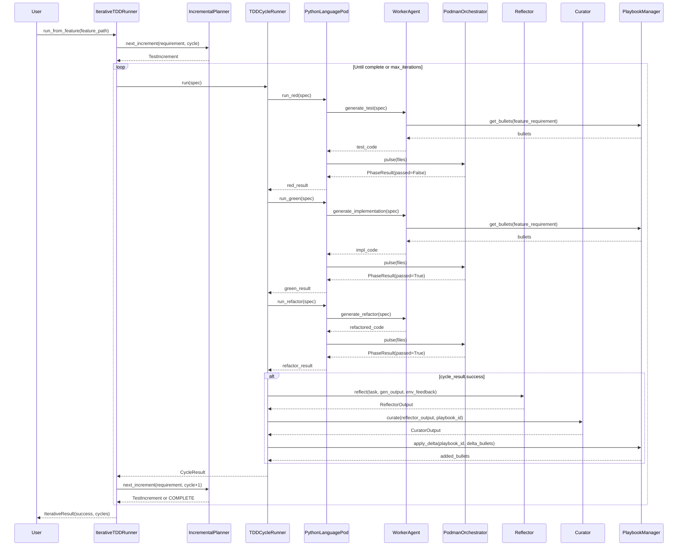

<!-- Generated by generate_live_docs.py on 2026-10-01 06:55 — do not edit by hand -->

# System Architecture

| Component | Module | Role |
|-----------|--------|------|
| IterativeTDDRunner | src/agents/iterative_tdd_runner.py | Orchestrates Kent Beck-style RED→GREEN→REFACTOR loop with planning |
| TDDCycleRunner | src/agents/tdd_cycle_runner.py | Executes one complete TDD cycle with retry logic and learning |
| PythonLanguagePod | src/agents/python_language_pod.py | Language-specific pod for Python TDD execution |
| WorkerAgent | src/agents/worker_agent.py | LLM code generation for test/implementation/refactor phases |
| PodmanOrchestrator | src/agents/podman_orchestrator.py | Stateless container execution layer for code validation |
| PodmanRunner | src/agents/podman_runner.py | Rootless Podman container lifecycle management |
| IncrementalPlanner | src/agents/incremental_planner.py | Determines next test increment via LLM planning |
| PlaybookManager | src/playbook/manager.py | Playbook CRUD, deduplication, token budgeting, persistence |
| ExperimentLogger | src/storage/experiment_logger.py | Unified TDD/ML experiment logging with PostgreSQL fallback |
| Reflector | src/core/reflector/module.py | Analyzes task outcomes and extracts learning insights |
| Curator | src/core/curator/module.py | Synthesizes reflector insights into playbook bullets |
| Generator | src/core/generator/module.py | Executes tasks using playbook-guided LLM generation |
| LLMClient | src/utils/llm_client.py | Unified interface for multiple LLM providers |
| PolyglotTDDRunner | src/agents/polyglot_tdd_runner.py | Orchestrates RED→GREEN→REFACTOR across multiple languages |
| GoLanguagePod | src/agents/go_language_pod.py | Language-specific pod for Go TDD execution |
| TypeScriptLanguagePod | src/agents/typescript_language_pod.py | Language-specific pod for TypeScript TDD execution |
| SimulationPod | src/agents/simulation_pod.py | Physics simulation pod for PyBullet-backed TDD |
| CharacterizationTestGenerator | src/agents/characterization_test_generator.py | Generates empirically-verified pytest characterization suites |
| EnsembleBuildRunner | src/agents/ensemble_build.py | Multi-candidate blind build orchestration |
| GherkinExtractionAgent | src/agents/gherkin_extraction_agent.py | Reverse-engineers Gherkin scenarios from code/tests |
| GherkinFeatureBridge | src/agents/gherkin_feature_bridge.py | Parses Gherkin .feature files into FeatureSpec |
| AdaptiveBroker | src/broker/adaptive_broker.py | Routes tasks to best agent based on performance history |
| PerformanceAggregator | src/broker/performance_aggregator.py | Extracts and aggregates metrics from audit trail |
| ProjectBuilder | src/cli/project_builder.py | Drives ModuleArchitect + ModuleTDDBuilder over ProjectPlan |
| ModuleArchitect | src/contracts/module_architect.py | Generates module-level contracts for stateful systems |
| ModuleTDDBuilder | src/contracts/module_tdd_builder.py | Builds module implementations using TDD methodology |
| ContractArchitect | src/contracts/contract_architect.py | Generates contracts from natural language requirements |
| ProjectArchitect | src/contracts/project_architect.py | Decomposes project spec into module DAG |
| EnsembleLearner | src/ensemble/learner.py | Orchestrates multiple models learning in parallel |
| BulletRetriever | src/playbook/retrieval.py | Hybrid retrieval system for selecting relevant bullets |
| ContextGraphRetriever | src/retrieval/cgr3_retriever.py | CGR³ context-aware retrieval with reasoning |
| InstitutionalKnowledgeService | src/retrieval/service.py | Central knowledge retrieval service for code generation |
| DistillationRouter | src/playbook/distillation_router.py | Routes tasks to domain-specific distillation playbooks |
| PlaybookReliabilityAnalyzer | src/reliability/playbook_analyzer.py | Correlates bullet retrieval with first-pass GREEN success |
| TDDCycleAnalyzer | src/reliability/tdd_cycle_analyzer.py | Measures first-pass rate and trend over time |

```mermaid
sequenceDiagram
    participant User
    participant IterativeTDDRunner
    participant IncrementalPlanner
    participant TDDCycleRunner
    participant PythonLanguagePod
    participant WorkerAgent
    participant PodmanOrchestrator
    participant Reflector
    participant Curator
    participant PlaybookManager

    User->>IterativeTDDRunner: run_from_feature(feature_path)
    IterativeTDDRunner->>IncrementalPlanner: next_increment(requirement, cycle)
    IncrementalPlanner-->>IterativeTDDRunner: TestIncrement
    
    loop Until complete or max_iterations
        IterativeTDDRunner->>TDDCycleRunner: run(spec)
        
        TDDCycleRunner->>PythonLanguagePod: run_red(spec)
        PythonLanguagePod->>WorkerAgent: generate_test(spec)
        WorkerAgent->>PlaybookManager: get_bullets(feature_requirement)
        PlaybookManager-->>WorkerAgent: bullets
        WorkerAgent-->>PythonLanguagePod: test_code
        PythonLanguagePod->>PodmanOrchestrator: pulse(files)
        PodmanOrchestrator-->>PythonLanguagePod: PhaseResult(passed=False)
        PythonLanguagePod-->>TDDCycleRunner: red_result
        
        TDDCycleRunner->>PythonLanguagePod: run_green(spec)
        PythonLanguagePod->>WorkerAgent: generate_implementation(spec)
        WorkerAgent->>PlaybookManager: get_bullets(feature_requirement)
        PlaybookManager-->>WorkerAgent: bullets
        WorkerAgent-->>PythonLanguagePod: impl_code
        PythonLanguagePod->>PodmanOrchestrator: pulse(files)
        PodmanOrchestrator-->>PythonLanguagePod: PhaseResult(passed=True)
        PythonLanguagePod-->>TDDCycleRunner: green_result
        
        TDDCycleRunner->>PythonLanguagePod: run_refactor(spec)
        PythonLanguagePod->>WorkerAgent: generate_refactor(spec)
        WorkerAgent-->>PythonLanguagePod: refactored_code
        PythonLanguagePod->>PodmanOrchestrator: pulse(files)
        PodmanOrchestrator-->>PythonLanguagePod: PhaseResult(passed=True)
        PythonLanguagePod-->>TDDCycleRunner: refactor_result
        
        alt cycle_result.success
            TDDCycleRunner->>Reflector: reflect(task, gen_output, env_feedback)
            Reflector-->>TDDCycleRunner: ReflectorOutput
            TDDCycleRunner->>Curator: curate(reflector_output, playbook_id)
            Curator-->>TDDCycleRunner: CuratorOutput
            TDDCycleRunner->>PlaybookManager: apply_delta(playbook_id, delta_bullets)
            PlaybookManager-->>TDDCycleRunner: added_bullets
        end
        
        TDDCycleRunner-->>IterativeTDDRunner: CycleResult
        IterativeTDDRunner->>IncrementalPlanner: next_increment(requirement, cycle+1)
        IncrementalPlanner-->>IterativeTDDRunner: TestIncrement or COMPLETE
    end
    
    IterativeTDDRunner-->>User: IterativeResult(success, cycles)
```
