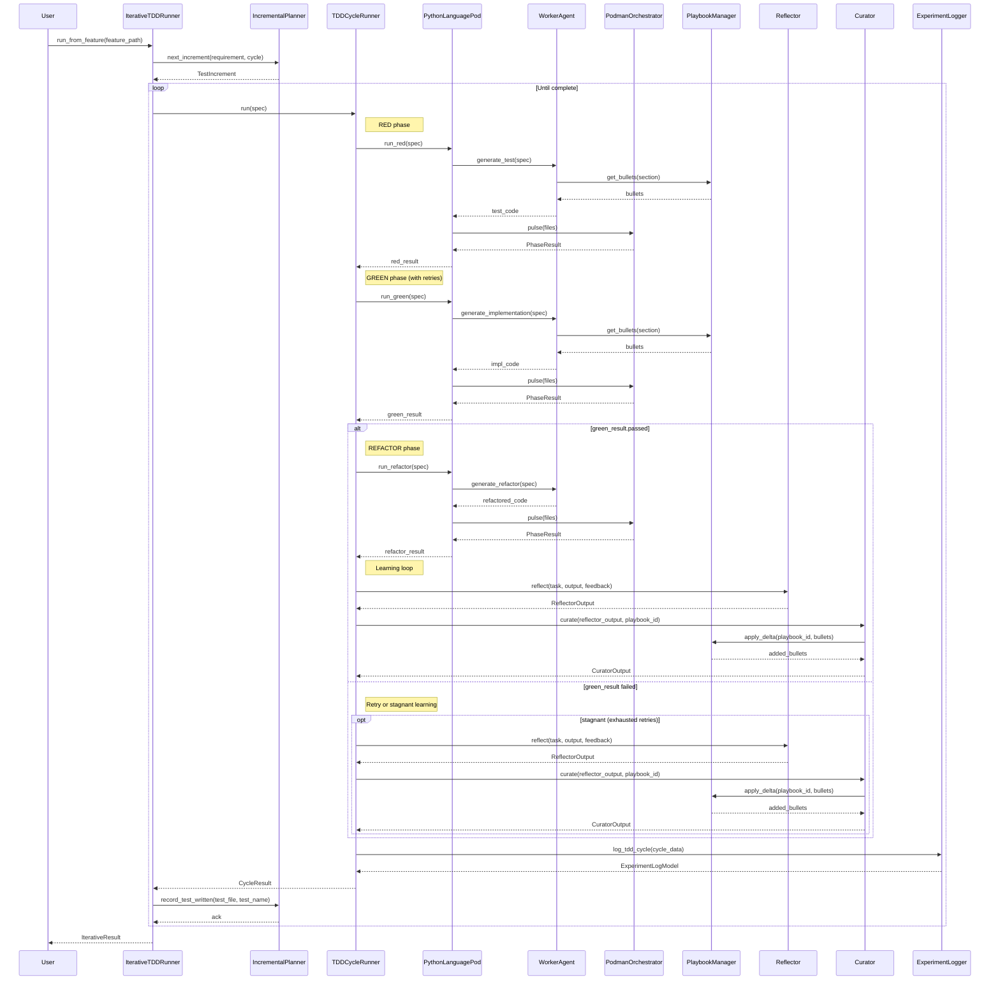

<!-- Generated by generate_live_docs.py on 2026-10-02 05:21 — do not edit by hand -->

# System Architecture

| Component | Module | Role |
|-----------|--------|------|
| TDDCycleRunner | src/agents/tdd_cycle_runner.py | Orchestrates RED→GREEN→REFACTOR for one feature; manages retries, escalation, learning loop, and audit trail |
| IterativeTDDRunner | src/agents/iterative_tdd_runner.py | Kent Beck-style loop: plans increments, runs cycles, repeats until complete |
| PythonLanguagePod | src/agents/python_language_pod.py | LanguagePod for Python; delegates code generation to WorkerAgent, execution to PodmanOrchestrator |
| WorkerAgent | src/agents/worker_agent.py | Generates test/implementation/refactor code; retrieves playbook bullets; returns raw code strings |
| PodmanOrchestrator | src/agents/podman_orchestrator.py | Stateless sidecar execution layer; runs files in sandboxed container, verifies hash chain |
| PodmanRunner | src/agents/podman_runner.py | ContainerRunner backed by rootless Podman; starts/stops container, sends pulse |
| IncrementalPlanner | src/agents/incremental_planner.py | Determines next test increment given current state; asks LLM for one failing test |
| PlaybookManager | src/playbook/manager.py | Core playbook operations: creation, updates, merging, retrieval, deduplication, token budgets |
| ExperimentLogger | src/storage/experiment_logger.py | Unified logger for TDD and ML experiments; PostgreSQL with SQLite fallback |
| Reflector | src/core/reflector/module.py | Analyzes task outcomes; extracts error patterns, root causes, key insights |
| Curator | src/core/curator/module.py | Synthesizes reflector insights into actionable playbook bullets; manages redundancy |
| Generator | src/core/generator/module.py | Executes tasks using playbook-guided LLM; retrieves bullets, tracks usage |
| ImportFilter | src/agents/import_filter.py | Validates code against forbidden imports and builtin calls; raises ForbiddenImportError |
| GherkinFeatureBridge | src/agents/gherkin_feature_bridge.py | Parses Gherkin .feature files into FeatureSpec; extracts scenarios and dependencies |
| PolyglotTDDRunner | src/agents/polyglot_tdd_runner.py | Orchestrates RED→GREEN→REFACTOR across multiple LanguagePods for different languages |
| PodFactory | src/agents/polyglot_tdd_runner.py | Creates LanguagePod instances for a given language identifier |
| EnsembleBuildRunner | src/agents/ensemble_build.py | Drives multi-candidate blind build for one feature; manages consensus and learning |
| BlindEvaluator | src/benchmark/blind_evaluation.py | Scores outputs without knowing which agent produced them; uses rubrics or heuristics |
| AdaptiveBroker | src/broker/adaptive_broker.py | Routes tasks to best agent based on historical performance and routing mode |
| PerformanceAggregator | src/broker/performance_aggregator.py | Extracts metrics from audit trail; computes success rates, reliability, variance |
| BrokerAdvisor | src/broker/advisor.py | Recommends agents by capability fit; calculates match scores |
| ProjectBuilder | src/cli/project_builder.py | Drives ModuleArchitect + ModuleTDDBuilder over a ProjectPlan in dependency order |
| ModuleArchitect | src/contracts/module_architect.py | Generates module-level contracts for stateful systems from requirements |
| ModuleTDDBuilder | src/contracts/module_tdd_builder.py | Builds module implementations using TDD methodology; manages function-level iteration |
| ContractOrchestrator | src/contracts/contract_driven.py | Orchestrates contract-driven development; registers contracts, validates implementations |
| ContractValidator | src/contracts/contract_driven.py | Validates implementations against contracts by running test cases in sandbox |
| EnsembleLearner | src/ensemble/learner.py | Ensemble learning system; executes models in parallel, conducts voting and deliberation |
| VotingSystem | src/ensemble/voting.py | Applies voting strategies to ensemble bullets; decides approval based on votes |
| DistillationRouter | src/playbook/distillation_router.py | Routes tasks to domain-specific distillation playbooks; manages provenance filtering |
| ContextGraphRetriever | src/retrieval/cgr3_retriever.py | CGR³ retriever; context-aware bullet ranking with reasoning and verdict |
| InstitutionalKnowledgeService | src/retrieval/service.py | Central knowledge retrieval service for all code generation activities |
| AuditStore | src/audit/store.py | Append-only audit event store with hash chain integrity verification |
| LocalAuditClient | src/audit/local_client.py | Audit client that writes directly to local SQLite database |
| AuditDashboard | src/audit/dashboard.py | Dashboard for analyzing audit data; computes agent performance and cost analysis |
| RegressionDetector | src/broker/regression_detector.py | Tracks quality scores by model/version; detects regressions via CUSUM |
| PlaybookReliabilityAnalyzer | src/reliability/playbook_analyzer.py | Correlates bullet retrieval with first-pass GREEN outcomes; computes uplift |
| TDDCycleAnalyzer | src/reliability/tdd_cycle_analyzer.py | Measures first-pass GREEN rate and trend over time |

```mermaid
sequenceDiagram
    participant User
    participant IterativeTDDRunner
    participant IncrementalPlanner
    participant TDDCycleRunner
    participant PythonLanguagePod
    participant WorkerAgent
    participant PodmanOrchestrator
    participant PlaybookManager
    participant Reflector
    participant Curator
    participant ExperimentLogger

    User->>IterativeTDDRunner: run_from_feature(feature_path)
    IterativeTDDRunner->>IncrementalPlanner: next_increment(requirement, cycle)
    IncrementalPlanner-->>IterativeTDDRunner: TestIncrement
    
    loop Until complete
        IterativeTDDRunner->>TDDCycleRunner: run(spec)
        
        Note right of TDDCycleRunner: RED phase
        TDDCycleRunner->>PythonLanguagePod: run_red(spec)
        PythonLanguagePod->>WorkerAgent: generate_test(spec)
        WorkerAgent->>PlaybookManager: get_bullets(section)
        PlaybookManager-->>WorkerAgent: bullets
        WorkerAgent-->>PythonLanguagePod: test_code
        PythonLanguagePod->>PodmanOrchestrator: pulse(files)
        PodmanOrchestrator-->>PythonLanguagePod: PhaseResult
        PythonLanguagePod-->>TDDCycleRunner: red_result
        
        Note right of TDDCycleRunner: GREEN phase (with retries)
        TDDCycleRunner->>PythonLanguagePod: run_green(spec)
        PythonLanguagePod->>WorkerAgent: generate_implementation(spec)
        WorkerAgent->>PlaybookManager: get_bullets(section)
        PlaybookManager-->>WorkerAgent: bullets
        WorkerAgent-->>PythonLanguagePod: impl_code
        PythonLanguagePod->>PodmanOrchestrator: pulse(files)
        PodmanOrchestrator-->>PythonLanguagePod: PhaseResult
        PythonLanguagePod-->>TDDCycleRunner: green_result
        
        alt green_result.passed
            Note right of TDDCycleRunner: REFACTOR phase
            TDDCycleRunner->>PythonLanguagePod: run_refactor(spec)
            PythonLanguagePod->>WorkerAgent: generate_refactor(spec)
            WorkerAgent-->>PythonLanguagePod: refactored_code
            PythonLanguagePod->>PodmanOrchestrator: pulse(files)
            PodmanOrchestrator-->>PythonLanguagePod: PhaseResult
            PythonLanguagePod-->>TDDCycleRunner: refactor_result
            
            Note right of TDDCycleRunner: Learning loop
            TDDCycleRunner->>Reflector: reflect(task, output, feedback)
            Reflector-->>TDDCycleRunner: ReflectorOutput
            TDDCycleRunner->>Curator: curate(reflector_output, playbook_id)
            Curator->>PlaybookManager: apply_delta(playbook_id, bullets)
            PlaybookManager-->>Curator: added_bullets
            Curator-->>TDDCycleRunner: CuratorOutput
        else green_result failed
            Note right of TDDCycleRunner: Retry or stagnant learning
            opt stagnant (exhausted retries)
                TDDCycleRunner->>Reflector: reflect(task, output, feedback)
                Reflector-->>TDDCycleRunner: ReflectorOutput
                TDDCycleRunner->>Curator: curate(reflector_output, playbook_id)
                Curator->>PlaybookManager: apply_delta(playbook_id, bullets)
                PlaybookManager-->>Curator: added_bullets
                Curator-->>TDDCycleRunner: CuratorOutput
            end
        end
        
        TDDCycleRunner->>ExperimentLogger: log_tdd_cycle(cycle_data)
        ExperimentLogger-->>TDDCycleRunner: ExperimentLogModel
        TDDCycleRunner-->>IterativeTDDRunner: CycleResult
        
        IterativeTDDRunner->>IncrementalPlanner: record_test_written(test_file, test_name)
        IncrementalPlanner-->>IterativeTDDRunner: ack
    end
    
    IterativeTDDRunner-->>User: IterativeResult
```
