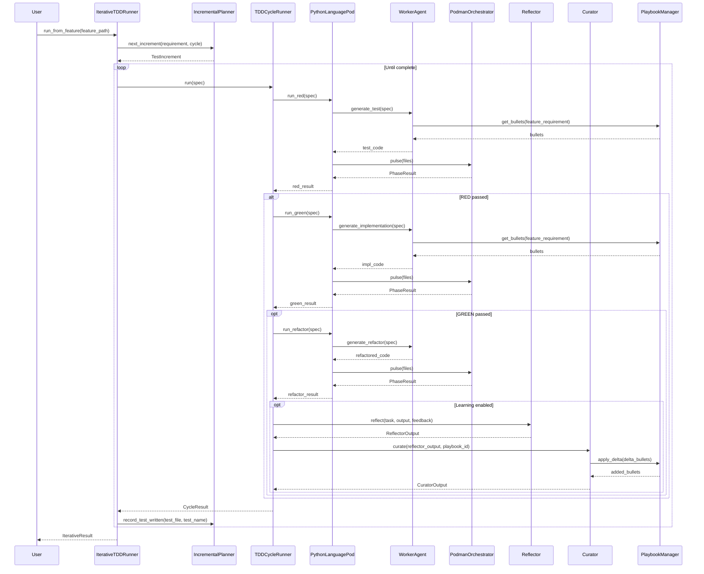

<!-- Generated by generate_live_docs.py on 2026-10-02 04:14 — do not edit by hand -->

# System Architecture

| Component | Module | Role |
|-----------|--------|------|
| TDDCycleRunner | src/agents/tdd_cycle_runner.py | Orchestrates RED→GREEN→REFACTOR for one feature; manages retries, escalation, learning loop, and audit trail |
| IterativeTDDRunner | src/agents/iterative_tdd_runner.py | Kent Beck-style loop: plans increments, runs cycles, repeats until complete |
| PythonLanguagePod | src/agents/python_language_pod.py | Executes RED/GREEN/REFACTOR phases for Python; manages file I/O, patching, token tracking |
| WorkerAgent | src/agents/worker_agent.py | Generates test/implementation/refactor code; retrieves playbook bullets; builds prompts |
| IncrementalPlanner | src/agents/incremental_planner.py | Determines next test increment given current state; asks LLM for planning |
| PodmanOrchestrator | src/agents/podman_orchestrator.py | Stateless sidecar execution layer; runs code in sandboxed container; validates hash chain |
| PodmanRunner | src/agents/podman_runner.py | ContainerRunner backed by rootless Podman; manages container lifecycle and pulse execution |
| PlaybookManager | src/playbook/manager.py | Core playbook operations: creation, updates, merging, retrieval, deduplication, token budgeting |
| ExperimentLogger | src/storage/experiment_logger.py | Unified logger for TDD and ML experiments; persists to PostgreSQL with SQLite fallback |
| Reflector | src/core/reflector/module.py | Analyzes task outcomes; extracts error patterns, root causes, insights; iterative refinement |
| Curator | src/core/curator/module.py | Synthesizes reflector insights into playbook bullets; manages redundancy and token budgets |
| Generator | src/core/generator/module.py | Executes tasks using playbook-guided LLM; retrieves bullets; tracks usage and latency |
| PolyglotTDDRunner | src/agents/polyglot_tdd_runner.py | Orchestrates RED→GREEN→REFACTOR across multiple language pods |
| EnsembleBuildRunner | src/agents/ensemble_build.py | Multi-candidate ("double-blind") feature build; consensus analysis and winner selection |
| ProjectBuilder | src/cli/project_builder.py | Drives ModuleArchitect + ModuleTDDBuilder over a ProjectPlan in dependency order |
| ModuleArchitect | src/contracts/module_architect.py | Generates module-level contracts for stateful systems from requirements |
| ModuleTDDBuilder | src/contracts/module_tdd_builder.py | Builds module implementations using TDD methodology with integration tests |
| ContractOrchestrator | src/contracts/contract_driven.py | Orchestrates contract-driven development; manages contract registration and validation |
| AdaptiveBroker | src/broker/adaptive_broker.py | Routes tasks to best agent based on learned performance; supports multiple routing modes |
| PerformanceAggregator | src/broker/performance_aggregator.py | Extracts metrics from audit trail; computes agent performance profiles |
| DistillationRouter | src/playbook/distillation_router.py | Routes tasks to domain-specific distillation playbooks; manages provenance filtering |
| InstitutionalKnowledgeService | src/retrieval/service.py | Central knowledge retrieval service; integrates CGR³ for context-aware guidance |
| ContextGraphRetriever | src/retrieval/cgr3_retriever.py | CGR³ pipeline: retrieve, rank, reason about pattern applicability |
| BlindEvaluator | src/benchmark/blind_evaluation.py | Scores outputs without knowing which agent produced them; domain-specific rubrics |
| PlaybookReliabilityAnalyzer | src/reliability/playbook_analyzer.py | Correlates bullet retrieval with first-pass GREEN success; computes causal uplift |
| TDDCycleAnalyzer | src/reliability/tdd_cycle_analyzer.py | Measures first-pass GREEN rate and trend over time |
| AuditStore | src/audit/store.py | Append-only audit event store with hash chain integrity verification |
| LocalAuditClient | src/audit/local_client.py | Audit client that writes directly to local SQLite database |
| AuditDashboard | src/audit/dashboard.py | Dashboard for analyzing audit data; agent performance and cost analysis |
| RegressionDetector | src/broker/regression_detector.py | Tracks quality scores by model/version; detects performance regressions |
| EnsembleLearner | src/ensemble/learner.py | Ensemble learning system; orchestrates multiple models with voting and deliberation |

```mermaid
sequenceDiagram
    participant User
    participant IterativeTDDRunner
    participant IncrementalPlanner
    participant TDDCycleRunner
    participant PythonLanguagePod
    participant WorkerAgent
    participant PodmanOrchestrator
    participant Reflector
    participant Curator
    participant PlaybookManager

    User->>IterativeTDDRunner: run_from_feature(feature_path)
    IterativeTDDRunner->>IncrementalPlanner: next_increment(requirement, cycle)
    IncrementalPlanner-->>IterativeTDDRunner: TestIncrement
    
    loop Until complete
        IterativeTDDRunner->>TDDCycleRunner: run(spec)
        
        TDDCycleRunner->>PythonLanguagePod: run_red(spec)
        PythonLanguagePod->>WorkerAgent: generate_test(spec)
        WorkerAgent->>PlaybookManager: get_bullets(feature_requirement)
        PlaybookManager-->>WorkerAgent: bullets
        WorkerAgent-->>PythonLanguagePod: test_code
        PythonLanguagePod->>PodmanOrchestrator: pulse(files)
        PodmanOrchestrator-->>PythonLanguagePod: PhaseResult
        PythonLanguagePod-->>TDDCycleRunner: red_result
        
        alt RED passed
            TDDCycleRunner->>PythonLanguagePod: run_green(spec)
            PythonLanguagePod->>WorkerAgent: generate_implementation(spec)
            WorkerAgent->>PlaybookManager: get_bullets(feature_requirement)
            PlaybookManager-->>WorkerAgent: bullets
            WorkerAgent-->>PythonLanguagePod: impl_code
            PythonLanguagePod->>PodmanOrchestrator: pulse(files)
            PodmanOrchestrator-->>PythonLanguagePod: PhaseResult
            PythonLanguagePod-->>TDDCycleRunner: green_result
            
            opt GREEN passed
                TDDCycleRunner->>PythonLanguagePod: run_refactor(spec)
                PythonLanguagePod->>WorkerAgent: generate_refactor(spec)
                WorkerAgent-->>PythonLanguagePod: refactored_code
                PythonLanguagePod->>PodmanOrchestrator: pulse(files)
                PodmanOrchestrator-->>PythonLanguagePod: PhaseResult
                PythonLanguagePod-->>TDDCycleRunner: refactor_result
                
                opt Learning enabled
                    TDDCycleRunner->>Reflector: reflect(task, output, feedback)
                    Reflector-->>TDDCycleRunner: ReflectorOutput
                    TDDCycleRunner->>Curator: curate(reflector_output, playbook_id)
                    Curator->>PlaybookManager: apply_delta(delta_bullets)
                    PlaybookManager-->>Curator: added_bullets
                    Curator-->>TDDCycleRunner: CuratorOutput
                end
            end
        end
        
        TDDCycleRunner-->>IterativeTDDRunner: CycleResult
        IterativeTDDRunner->>IncrementalPlanner: record_test_written(test_file, test_name)
    end
    
    IterativeTDDRunner-->>User: IterativeResult
```
