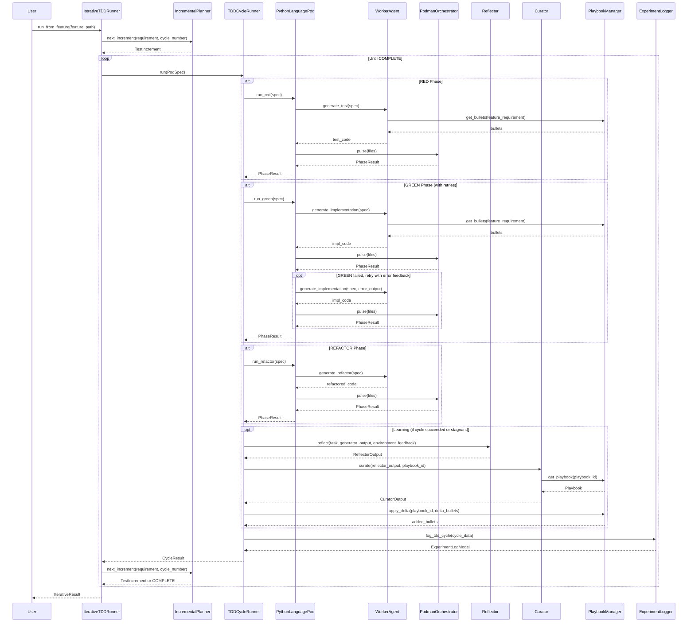

<!-- Generated by generate_live_docs.py on 2026-10-01 07:24 — do not edit by hand -->

# System Architecture

| Component | Module | Role |
|-----------|--------|------|
| IterativeTDDRunner | src/agents/iterative_tdd_runner.py | Orchestrates RED→GREEN→REFACTOR loop; drives TDD cycles until completion |
| TDDCycleRunner | src/agents/tdd_cycle_runner.py | Executes one complete TDD cycle with retry logic, learning, and audit trail |
| IncrementalPlanner | src/agents/incremental_planner.py | Plans next test increment; routes Gherkin scenarios into TDD cycles |
| WorkerAgent | src/agents/worker_agent.py | Generates test/implementation/refactor code; retrieves playbook bullets |
| PythonLanguagePod | src/agents/python_language_pod.py | Python TDD pod; orchestrates RED/GREEN/REFACTOR via WorkerAgent + PodmanOrchestrator |
| PodmanOrchestrator | src/agents/podman_orchestrator.py | Stateless sidecar execution layer; runs code in sandboxed container |
| PodmanRunner | src/agents/podman_runner.py | ContainerRunner backed by rootless Podman; manages container lifecycle |
| PlaybookManager | src/playbook/manager.py | Core playbook operations: create, update, merge, retrieve bullets |
| Reflector | src/core/reflector/module.py | Analyzes task outcomes; extracts error patterns and learning insights |
| Curator | src/core/curator/module.py | Synthesizes reflector insights into playbook delta bullets |
| Generator | src/core/generator/module.py | Executes tasks using playbook-guided LLM generation |
| ExperimentLogger | src/storage/experiment_logger.py | Persists TDD cycles and ML experiments to PostgreSQL/SQLite |
| LLMClient | src/utils/llm_client.py | Unified LLM interface; routes to OpenRouter, Ollama, OpenAI, Anthropic, etc. |
| GherkinFeatureBridge | src/agents/gherkin_feature_bridge.py | Parses .feature files into FeatureSpec; extracts scenarios and dependencies |
| PolyglotTDDRunner | src/agents/polyglot_tdd_runner.py | Drives RED→GREEN→REFACTOR across multiple language pods |
| PodFactory | src/agents/polyglot_tdd_runner.py | Creates language-specific LanguagePod instances |
| EnsembleBuildRunner | src/agents/ensemble_build.py | Multi-candidate blind build; runs feature through multiple models |
| BlindEvaluator | src/benchmark/blind_evaluation.py | Scores outputs without knowing which agent produced them |
| AdaptiveBroker | src/broker/adaptive_broker.py | Routes tasks to best agent based on learned performance |
| PerformanceAggregator | src/broker/performance_aggregator.py | Extracts and aggregates metrics from audit trail |
| ProjectBuilder | src/cli/project_builder.py | Drives ModuleArchitect + ModuleTDDBuilder over ProjectPlan |
| ModuleArchitect | src/contracts/module_architect.py | Generates module-level contracts for stateful systems |
| ModuleTDDBuilder | src/contracts/module_tdd_builder.py | Builds module implementations using TDD methodology |
| ContractOrchestrator | src/contracts/contract_driven.py | Orchestrates contract-driven development across agents |
| EnsembleLearner | src/ensemble/learner.py | Ensemble learning system; coordinates multiple models learning in parallel |
| DistillationRouter | src/playbook/distillation_router.py | Routes tasks to domain-specific distillation playbooks |
| InstitutionalKnowledgeService | src/retrieval/service.py | Central knowledge retrieval service for code generation activities |
| ContextGraphRetriever | src/retrieval/cgr3_retriever.py | CGR³ retriever; context-aware bullet ranking and reasoning |
| RedundancyPreChecker | src/agents/redundancy_checker.py | Pre-checks proposed tests for redundancy before RED phase |
| CharacterizationTestGenerator | src/agents/characterization_test_generator.py | Writes empirically-verified pytest characterization suites |
| SimulationPod | src/agents/simulation_pod.py | LanguagePod for physics simulation TDD cycles |
| SimulationOracle | src/agents/simulation_oracle.py | Runs controller scripts against SimulationScenario inside PyBullet |

```mermaid
sequenceDiagram
    participant User
    participant IterativeTDDRunner
    participant IncrementalPlanner
    participant TDDCycleRunner
    participant PythonLanguagePod
    participant WorkerAgent
    participant PodmanOrchestrator
    participant Reflector
    participant Curator
    participant PlaybookManager
    participant ExperimentLogger

    User->>IterativeTDDRunner: run_from_feature(feature_path)
    IterativeTDDRunner->>IncrementalPlanner: next_increment(requirement, cycle_number)
    IncrementalPlanner-->>IterativeTDDRunner: TestIncrement
    
    loop Until COMPLETE
        IterativeTDDRunner->>TDDCycleRunner: run(PodSpec)
        
        alt RED Phase
            TDDCycleRunner->>PythonLanguagePod: run_red(spec)
            PythonLanguagePod->>WorkerAgent: generate_test(spec)
            WorkerAgent->>PlaybookManager: get_bullets(feature_requirement)
            PlaybookManager-->>WorkerAgent: bullets
            WorkerAgent-->>PythonLanguagePod: test_code
            PythonLanguagePod->>PodmanOrchestrator: pulse(files)
            PodmanOrchestrator-->>PythonLanguagePod: PhaseResult
            PythonLanguagePod-->>TDDCycleRunner: PhaseResult
        end
        
        alt GREEN Phase (with retries)
            TDDCycleRunner->>PythonLanguagePod: run_green(spec)
            PythonLanguagePod->>WorkerAgent: generate_implementation(spec)
            WorkerAgent->>PlaybookManager: get_bullets(feature_requirement)
            PlaybookManager-->>WorkerAgent: bullets
            WorkerAgent-->>PythonLanguagePod: impl_code
            PythonLanguagePod->>PodmanOrchestrator: pulse(files)
            PodmanOrchestrator-->>PythonLanguagePod: PhaseResult
            opt GREEN failed, retry with error feedback
                PythonLanguagePod->>WorkerAgent: generate_implementation(spec, error_output)
                WorkerAgent-->>PythonLanguagePod: impl_code
                PythonLanguagePod->>PodmanOrchestrator: pulse(files)
                PodmanOrchestrator-->>PythonLanguagePod: PhaseResult
            end
            PythonLanguagePod-->>TDDCycleRunner: PhaseResult
        end
        
        alt REFACTOR Phase
            TDDCycleRunner->>PythonLanguagePod: run_refactor(spec)
            PythonLanguagePod->>WorkerAgent: generate_refactor(spec)
            WorkerAgent-->>PythonLanguagePod: refactored_code
            PythonLanguagePod->>PodmanOrchestrator: pulse(files)
            PodmanOrchestrator-->>PythonLanguagePod: PhaseResult
            PythonLanguagePod-->>TDDCycleRunner: PhaseResult
        end
        
        opt Learning (if cycle succeeded or stagnant)
            TDDCycleRunner->>Reflector: reflect(task, generator_output, environment_feedback)
            Reflector-->>TDDCycleRunner: ReflectorOutput
            TDDCycleRunner->>Curator: curate(reflector_output, playbook_id)
            Curator->>PlaybookManager: get_playbook(playbook_id)
            PlaybookManager-->>Curator: Playbook
            Curator-->>TDDCycleRunner: CuratorOutput
            TDDCycleRunner->>PlaybookManager: apply_delta(playbook_id, delta_bullets)
            PlaybookManager-->>TDDCycleRunner: added_bullets
        end
        
        TDDCycleRunner->>ExperimentLogger: log_tdd_cycle(cycle_data)
        ExperimentLogger-->>TDDCycleRunner: ExperimentLogModel
        TDDCycleRunner-->>IterativeTDDRunner: CycleResult
        
        IterativeTDDRunner->>IncrementalPlanner: next_increment(requirement, cycle_number)
        IncrementalPlanner-->>IterativeTDDRunner: TestIncrement or COMPLETE
    end
    
    IterativeTDDRunner-->>User: IterativeResult
```
