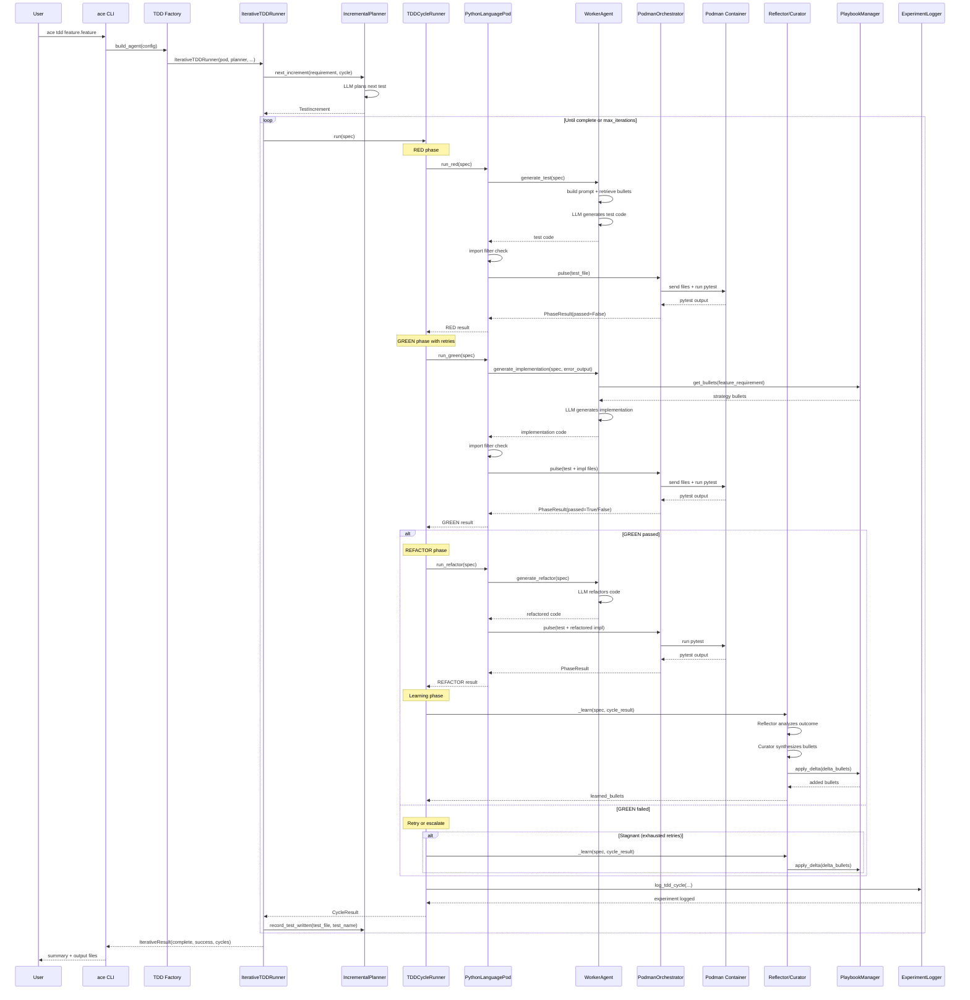

<!-- Generated by generate_live_docs.py on 2026-10-01 21:52 — do not edit by hand -->

# System Architecture

| Component | Module | Role |
|-----------|--------|------|
| TDDCycleRunner | src/agents/tdd_cycle_runner.py | Orchestrates RED→GREEN→REFACTOR for one feature; manages retries, escalation, learning loop, and audit trail |
| IterativeTDDRunner | src/agents/iterative_tdd_runner.py | Kent Beck-style loop: plans increments, runs cycles, repeats until complete |
| IncrementalPlanner | src/agents/incremental_planner.py | Determines next test increment given current state; LLM-driven planning |
| WorkerAgent | src/agents/worker_agent.py | Generates test/implementation/refactor code; retrieves playbook bullets; manages token tracking |
| PythonLanguagePod | src/agents/python_language_pod.py | Python TDD pod; RED/GREEN/REFACTOR phases; patch-mode support; escalation handling |
| PodmanOrchestrator | src/agents/podman_orchestrator.py | Stateless execution layer; sends files to container; validates security; returns phase results |
| PodmanRunner | src/agents/podman_runner.py | Rootless Podman container lifecycle; file I/O; test execution |
| PlaybookManager | src/playbook/manager.py | Playbook CRUD; bullet management; deduplication; token budgets; persistence |
| ExperimentLogger | src/storage/experiment_logger.py | Logs TDD cycles and ML experiments; PostgreSQL with SQLite fallback |
| Reflector | src/core/reflector/module.py | Analyzes task outcomes; extracts error patterns, root causes, insights |
| Curator | src/core/curator/module.py | Synthesizes reflector insights into playbook bullets; manages supersedes relationships |
| Generator | src/core/generator/module.py | Executes tasks with playbook context; retrieves bullets; tracks usage |
| LLMClient | src/utils/llm_client.py | Unified LLM interface; supports OpenRouter, Ollama, OpenAI, Anthropic, DeepSeek, Together |
| ImportFilter | src/agents/import_filter.py | Validates generated code; blocks forbidden imports and unsafe builtins |
| GherkinFeatureBridge | src/agents/gherkin_feature_bridge.py | Parses .feature files into FeatureSpec; extracts scenarios and dependencies |
| PolyglotTDDRunner | src/agents/polyglot_tdd_runner.py | Orchestrates RED→GREEN→REFACTOR across multiple languages |
| PodFactory | src/agents/polyglot_tdd_runner.py | Creates language-specific LanguagePod instances |
| ModuleArchitect | src/contracts/module_architect.py | Generates module-level contracts from requirements; validates consistency |
| ModuleTDDBuilder | src/contracts/module_tdd_builder.py | Builds modules using TDD; manages function-level iteration and integration tests |
| ProjectBuilder | src/cli/project_builder.py | Drives ModuleArchitect and ModuleTDDBuilder over ProjectPlan in dependency order |
| ProjectArchitect | src/contracts/project_architect.py | Decomposes project spec into module DAG; orders by dependencies |
| AdaptiveBroker | src/broker/adaptive_broker.py | Routes tasks to best agent based on historical performance and cost/quality tradeoffs |
| PerformanceAggregator | src/broker/performance_aggregator.py | Extracts metrics from audit trail; computes reliability and variance-adjusted scores |
| BulletRetriever | src/playbook/retrieval.py | Hybrid retrieval: keyword + semantic similarity; filters by context and confidence |
| ContextGraphRetriever | src/retrieval/cgr3_retriever.py | CGR³ pipeline: retrieve, rank by context, reason about applicability |
| InstitutionalKnowledgeService | src/retrieval/service.py | Central knowledge retrieval for code generation; routes to playbook/CGR³ |
| BlindEvaluator | src/benchmark/blind_evaluation.py | Scores outputs without knowing agent identity; runs tests in sandbox |
| SuccessRateCalculator | src/analytics/success_rate_calculator.py | Measures experiment success rates across types, versions, time windows |
| TokenEfficiencyReporter | src/analytics/token_efficiency.py | Aggregates token usage; computes efficiency scores and cross-language comparison |
| AuditStore | src/audit/store.py | Append-only hash-chained audit log; integrity verification |
| LocalAuditClient | src/audit/local_client.py | Writes audit events to local SQLite; development/testing |
| DriftDetector | src/utils/file_lock.py | Detects inadvertent file changes; prevents silent data loss |

```mermaid
sequenceDiagram
    participant User
    participant CLI as ace CLI
    participant Factory as TDD Factory
    participant Runner as IterativeTDDRunner
    participant Planner as IncrementalPlanner
    participant Cycle as TDDCycleRunner
    participant Pod as PythonLanguagePod
    participant Worker as WorkerAgent
    participant Orchestrator as PodmanOrchestrator
    participant Container as Podman Container
    participant Learn as Reflector/Curator
    participant Playbook as PlaybookManager
    participant Logger as ExperimentLogger

    User->>CLI: ace tdd feature.feature
    CLI->>Factory: build_agent(config)
    Factory->>Runner: IterativeTDDRunner(pod, planner, ...)
    
    Runner->>Planner: next_increment(requirement, cycle)
    Planner->>Planner: LLM plans next test
    Planner-->>Runner: TestIncrement
    
    loop Until complete or max_iterations
        Runner->>Cycle: run(spec)
        
        Note over Cycle: RED phase
        Cycle->>Pod: run_red(spec)
        Pod->>Worker: generate_test(spec)
        Worker->>Worker: build prompt + retrieve bullets
        Worker->>Worker: LLM generates test code
        Worker-->>Pod: test code
        Pod->>Pod: import filter check
        Pod->>Orchestrator: pulse(test_file)
        Orchestrator->>Container: send files + run pytest
        Container-->>Orchestrator: pytest output
        Orchestrator-->>Pod: PhaseResult(passed=False)
        Pod-->>Cycle: RED result
        
        Note over Cycle: GREEN phase with retries
        Cycle->>Pod: run_green(spec)
        Pod->>Worker: generate_implementation(spec, error_output)
        Worker->>Playbook: get_bullets(feature_requirement)
        Playbook-->>Worker: strategy bullets
        Worker->>Worker: LLM generates implementation
        Worker-->>Pod: implementation code
        Pod->>Pod: import filter check
        Pod->>Orchestrator: pulse(test + impl files)
        Orchestrator->>Container: send files + run pytest
        Container-->>Orchestrator: pytest output
        Orchestrator-->>Pod: PhaseResult(passed=True/False)
        Pod-->>Cycle: GREEN result
        
        alt GREEN passed
            Note over Cycle: REFACTOR phase
            Cycle->>Pod: run_refactor(spec)
            Pod->>Worker: generate_refactor(spec)
            Worker->>Worker: LLM refactors code
            Worker-->>Pod: refactored code
            Pod->>Orchestrator: pulse(test + refactored impl)
            Orchestrator->>Container: run pytest
            Container-->>Orchestrator: pytest output
            Orchestrator-->>Pod: PhaseResult
            Pod-->>Cycle: REFACTOR result
            
            Note over Cycle: Learning phase
            Cycle->>Learn: _learn(spec, cycle_result)
            Learn->>Learn: Reflector analyzes outcome
            Learn->>Learn: Curator synthesizes bullets
            Learn->>Playbook: apply_delta(delta_bullets)
            Playbook-->>Learn: added bullets
            Learn-->>Cycle: learned_bullets
        else GREEN failed
            Note over Cycle: Retry or escalate
            alt Stagnant (exhausted retries)
                Cycle->>Learn: _learn(spec, cycle_result)
                Learn->>Playbook: apply_delta(delta_bullets)
            end
        end
        
        Cycle->>Logger: log_tdd_cycle(...)
        Logger-->>Cycle: experiment logged
        Cycle-->>Runner: CycleResult
        
        Runner->>Planner: record_test_written(test_file, test_name)
    end
    
    Runner-->>CLI: IterativeResult(complete, success, cycles)
    CLI-->>User: summary + output files
```
