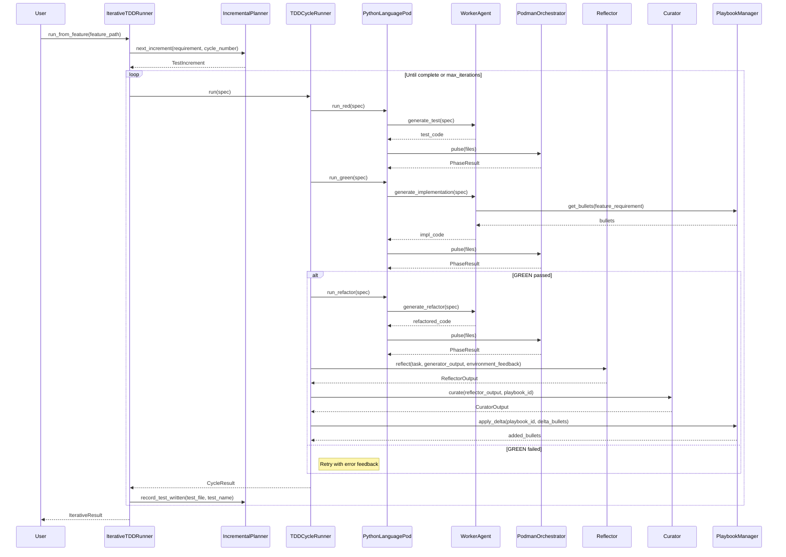

<!-- Generated by generate_live_docs.py on 2026-10-02 21:35 — do not edit by hand -->

# System Architecture

| Component | Module | Role |
|-----------|--------|------|
| TDDCycleRunner | src/agents/tdd_cycle_runner.py | Orchestrates RED→GREEN→REFACTOR for one feature; manages retries, escalation, learning loop |
| IterativeTDDRunner | src/agents/iterative_tdd_runner.py | Kent Beck-style loop: plan → RED → GREEN → REFACTOR → repeat until complete |
| PythonLanguagePod | src/agents/python_language_pod.py | LanguagePod for Python; delegates code generation to WorkerAgent, execution to PodmanOrchestrator |
| WorkerAgent | src/agents/worker_agent.py | Standalone LLM code-generation component; generates test/impl/refactor code given PodSpec |
| IncrementalPlanner | src/agents/incremental_planner.py | Determines next test increment; asks LLM what to write next in TDD loop |
| PodmanOrchestrator | src/agents/podman_orchestrator.py | Stateless sidecar execution layer; runs code in sandboxed Podman container |
| PodmanRunner | src/agents/podman_runner.py | ContainerRunner backed by rootless Podman; starts/stops container, sends pulse |
| PlaybookManager | src/playbook/manager.py | Core playbook operations: creation, updates, merging, retrieval; manages bullets |
| ExperimentLogger | src/storage/experiment_logger.py | Unified logger for TDD and ML experiments; persists to PostgreSQL with SQLite fallback |
| Reflector | src/core/reflector/module.py | Analyzes task outcomes; extracts error patterns, root causes, key insights |
| Curator | src/core/curator/module.py | Synthesizes reflector insights into actionable playbook updates (delta bullets) |
| Generator | src/core/generator/module.py | Executes tasks using playbook-guided LLM; retrieves relevant bullets, tracks usage |
| ImportFilter | src/agents/import_filter.py | Validates generated code; rejects forbidden imports and unsafe builtin calls |
| PolyglotTDDRunner | src/agents/polyglot_tdd_runner.py | Orchestrates RED→GREEN→REFACTOR across multiple LanguagePods (Python/Go/TypeScript) |
| PodFactory | src/agents/polyglot_tdd_runner.py | Creates LanguagePod instances for a given language identifier |
| EnsembleBuildRunner | src/agents/ensemble_build.py | Drives multi-candidate blind build for one feature; manages consensus and learning |
| BlindEvaluator | src/benchmark/blind_evaluation.py | Scores outputs without knowing which agent produced them; uses rubrics or heuristics |
| AdaptiveBroker | src/broker/adaptive_broker.py | Routes tasks to best agent based on learned performance; supports multiple routing modes |
| PerformanceAggregator | src/broker/performance_aggregator.py | Extracts metrics from audit trail; computes per-agent success rates and reliability |
| ProjectBuilder | src/cli/project_builder.py | Drives ModuleArchitect + ModuleTDDBuilder over a ProjectPlan in dependency order |
| ModuleArchitect | src/contracts/module_architect.py | Generates module-level contracts for stateful systems from requirements |
| ModuleTDDBuilder | src/contracts/module_tdd_builder.py | Builds module implementations using TDD methodology; handles integration tests |
| ContractArchitect | src/contracts/contract_architect.py | Generates contracts from natural language requirements; decomposes into interface contracts |
| ProjectArchitect | src/contracts/project_architect.py | Decomposes project spec into a module DAG; generates ProjectPlan |
| GherkinExtractionAgent | src/agents/gherkin_extraction_agent.py | Reverse engineers Gherkin scenarios from existing code and tests |
| CharacterizationTestGenerator | src/agents/characterization_test_generator.py | Writes empirically-verified pytest tests; drafts, verifies, and repairs suite |
| BulletRetriever | src/playbook/retrieval.py | Hybrid retrieval system for selecting relevant bullets; scores by relevance |
| ContextGraphRetriever | src/retrieval/cgr3_retriever.py | CGR³ retriever; context-aware ranking with reasoning about pattern applicability |
| InstitutionalKnowledgeService | src/retrieval/service.py | Central knowledge retrieval service for all code generation activities |
| AuditStore | src/audit/store.py | Append-only audit event store with hash chain integrity verification |
| LocalAuditClient | src/audit/local_client.py | Audit client that writes directly to local SQLite database |
| SuccessRateCalculator | src/analytics/success_rate_calculator.py | Measures experiment success rates across system; tracks by type and playbook version |
| TokenEfficiencyReporter | src/analytics/token_efficiency.py | Computes token efficiency scores from LanguagePod run data; cross-language comparison |
| PlaybookReliabilityAnalyzer | src/reliability/playbook_analyzer.py | Correlates bullet retrieval with first-pass GREEN outcomes; computes causal uplift |
| TDDCycleAnalyzer | src/reliability/tdd_cycle_analyzer.py | Measures first-pass GREEN rate and trend over time |
| RegressionDetector | src/broker/regression_detector.py | Tracks quality scores by model version; detects regressions using CUSUM |
| EnsembleLearner | src/ensemble/learner.py | Ensemble learning system; orchestrates multiple models learning in parallel with voting |

```mermaid
sequenceDiagram
    participant User
    participant IterativeTDDRunner
    participant IncrementalPlanner
    participant TDDCycleRunner
    participant PythonLanguagePod
    participant WorkerAgent
    participant PodmanOrchestrator
    participant Reflector
    participant Curator
    participant PlaybookManager

    User->>IterativeTDDRunner: run_from_feature(feature_path)
    IterativeTDDRunner->>IncrementalPlanner: next_increment(requirement, cycle_number)
    IncrementalPlanner-->>IterativeTDDRunner: TestIncrement
    
    loop Until complete or max_iterations
        IterativeTDDRunner->>TDDCycleRunner: run(spec)
        
        TDDCycleRunner->>PythonLanguagePod: run_red(spec)
        PythonLanguagePod->>WorkerAgent: generate_test(spec)
        WorkerAgent-->>PythonLanguagePod: test_code
        PythonLanguagePod->>PodmanOrchestrator: pulse(files)
        PodmanOrchestrator-->>PythonLanguagePod: PhaseResult
        
        TDDCycleRunner->>PythonLanguagePod: run_green(spec)
        PythonLanguagePod->>WorkerAgent: generate_implementation(spec)
        WorkerAgent->>PlaybookManager: get_bullets(feature_requirement)
        PlaybookManager-->>WorkerAgent: bullets
        WorkerAgent-->>PythonLanguagePod: impl_code
        PythonLanguagePod->>PodmanOrchestrator: pulse(files)
        PodmanOrchestrator-->>PythonLanguagePod: PhaseResult
        
        alt GREEN passed
            TDDCycleRunner->>PythonLanguagePod: run_refactor(spec)
            PythonLanguagePod->>WorkerAgent: generate_refactor(spec)
            WorkerAgent-->>PythonLanguagePod: refactored_code
            PythonLanguagePod->>PodmanOrchestrator: pulse(files)
            PodmanOrchestrator-->>PythonLanguagePod: PhaseResult
            
            TDDCycleRunner->>Reflector: reflect(task, generator_output, environment_feedback)
            Reflector-->>TDDCycleRunner: ReflectorOutput
            
            TDDCycleRunner->>Curator: curate(reflector_output, playbook_id)
            Curator-->>TDDCycleRunner: CuratorOutput
            
            TDDCycleRunner->>PlaybookManager: apply_delta(playbook_id, delta_bullets)
            PlaybookManager-->>TDDCycleRunner: added_bullets
        else GREEN failed
            Note right of TDDCycleRunner: Retry with error feedback
        end
        
        TDDCycleRunner-->>IterativeTDDRunner: CycleResult
        IterativeTDDRunner->>IncrementalPlanner: record_test_written(test_file, test_name)
    end
    
    IterativeTDDRunner-->>User: IterativeResult
```
