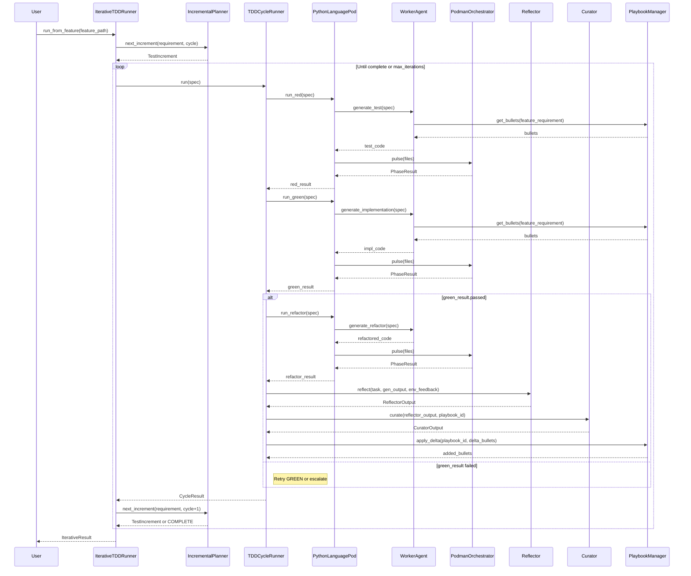

<!-- Generated by generate_live_docs.py on 2026-10-01 08:04 — do not edit by hand -->

# System Architecture

| Component | Module | Role |
|-----------|--------|------|
| IterativeTDDRunner | src/agents/iterative_tdd_runner.py | Orchestrates RED→GREEN→REFACTOR loop; drives TDD cycles until completion |
| TDDCycleRunner | src/agents/tdd_cycle_runner.py | Executes one complete TDD cycle with retry logic, learning, and audit trail |
| PythonLanguagePod | src/agents/python_language_pod.py | LanguagePod for Python; manages RED/GREEN/REFACTOR phases with patch mode support |
| WorkerAgent | src/agents/worker_agent.py | Generates test/implementation/refactor code; retrieves playbook bullets |
| PodmanOrchestrator | src/agents/podman_orchestrator.py | Stateless sidecar execution layer; runs code in sandboxed containers |
| PodmanRunner | src/agents/podman_runner.py | ContainerRunner using rootless Podman; manages container lifecycle |
| IncrementalPlanner | src/agents/incremental_planner.py | Plans next test increment; determines what to write in each cycle |
| PlaybookManager | src/playbook/manager.py | Core playbook operations: creation, updates, merging, retrieval, deduplication |
| ExperimentLogger | src/storage/experiment_logger.py | Logs TDD cycles and ML experiments; persists to PostgreSQL with SQLite fallback |
| Reflector | src/core/reflector/module.py | Analyzes task outcomes; extracts error patterns, root causes, and insights |
| Curator | src/core/curator/module.py | Synthesizes reflector insights into playbook bullets; manages delta updates |
| Generator | src/core/generator/module.py | Executes tasks using playbook-guided LLM; retrieves and tracks bullet usage |
| PolyglotTDDRunner | src/agents/polyglot_tdd_runner.py | Orchestrates RED→GREEN→REFACTOR across multiple language pods |
| PodFactory | src/agents/polyglot_tdd_runner.py | Creates LanguagePod instances for requested languages |
| EnsembleBuildRunner | src/agents/ensemble_build.py | Drives multi-candidate blind build; manages consensus and winner selection |
| BlindEvaluator | src/benchmark/blind_evaluation.py | Scores outputs without knowing agent identity; uses rubrics and heuristics |
| AdaptiveBroker | src/broker/adaptive_broker.py | Routes tasks to best agent based on learned performance metrics |
| PerformanceAggregator | src/broker/performance_aggregator.py | Extracts and aggregates performance metrics from audit trail |
| ProjectBuilder | src/cli/project_builder.py | Drives ModuleArchitect and ModuleTDDBuilder over ProjectPlan in dependency order |
| ModuleArchitect | src/contracts/module_architect.py | Generates module-level contracts for stateful systems |
| ModuleTDDBuilder | src/contracts/module_tdd_builder.py | Builds module implementations using TDD methodology |
| ContractArchitect | src/contracts/contract_architect.py | Generates contracts from natural language requirements |
| ProjectArchitect | src/contracts/project_architect.py | Decomposes project spec into module DAG with dependency ordering |
| EnsembleLearner | src/ensemble/learner.py | Orchestrates multi-model learning with voting and deliberation |
| InstitutionalKnowledgeService | src/retrieval/service.py | Central knowledge retrieval service for code generation activities |
| ContextGraphRetriever | src/retrieval/cgr3_retriever.py | CGR³ retriever: context-aware bullet ranking with reasoning |
| BulletRetriever | src/playbook/retrieval.py | Hybrid retrieval system for selecting relevant playbook bullets |
| DistillationRouter | src/playbook/distillation_router.py | Routes tasks to domain-specific distillation playbooks |
| TDDFailureRecorder | src/agents/tdd_failure_recorder.py | Records TDD failures and interventions for self-improvement |
| RedundancyPreChecker | src/agents/redundancy_checker.py | Pre-checks proposed tests for redundancy before RED phase |
| TestReviewAgent | src/agents/test_review_agent.py | Validates test quality before TDD implementation |
| CharacterizationTestGenerator | src/agents/characterization_test_generator.py | Writes empirically-verified pytest characterization suites |

```mermaid
sequenceDiagram
    participant User
    participant IterativeTDDRunner
    participant IncrementalPlanner
    participant TDDCycleRunner
    participant PythonLanguagePod
    participant WorkerAgent
    participant PodmanOrchestrator
    participant Reflector
    participant Curator
    participant PlaybookManager

    User->>IterativeTDDRunner: run_from_feature(feature_path)
    IterativeTDDRunner->>IncrementalPlanner: next_increment(requirement, cycle)
    IncrementalPlanner-->>IterativeTDDRunner: TestIncrement
    
    loop Until complete or max_iterations
        IterativeTDDRunner->>TDDCycleRunner: run(spec)
        
        TDDCycleRunner->>PythonLanguagePod: run_red(spec)
        PythonLanguagePod->>WorkerAgent: generate_test(spec)
        WorkerAgent->>PlaybookManager: get_bullets(feature_requirement)
        PlaybookManager-->>WorkerAgent: bullets
        WorkerAgent-->>PythonLanguagePod: test_code
        PythonLanguagePod->>PodmanOrchestrator: pulse(files)
        PodmanOrchestrator-->>PythonLanguagePod: PhaseResult
        PythonLanguagePod-->>TDDCycleRunner: red_result
        
        TDDCycleRunner->>PythonLanguagePod: run_green(spec)
        PythonLanguagePod->>WorkerAgent: generate_implementation(spec)
        WorkerAgent->>PlaybookManager: get_bullets(feature_requirement)
        PlaybookManager-->>WorkerAgent: bullets
        WorkerAgent-->>PythonLanguagePod: impl_code
        PythonLanguagePod->>PodmanOrchestrator: pulse(files)
        PodmanOrchestrator-->>PythonLanguagePod: PhaseResult
        PythonLanguagePod-->>TDDCycleRunner: green_result
        
        alt green_result.passed
            TDDCycleRunner->>PythonLanguagePod: run_refactor(spec)
            PythonLanguagePod->>WorkerAgent: generate_refactor(spec)
            WorkerAgent-->>PythonLanguagePod: refactored_code
            PythonLanguagePod->>PodmanOrchestrator: pulse(files)
            PodmanOrchestrator-->>PythonLanguagePod: PhaseResult
            PythonLanguagePod-->>TDDCycleRunner: refactor_result
            
            TDDCycleRunner->>Reflector: reflect(task, gen_output, env_feedback)
            Reflector-->>TDDCycleRunner: ReflectorOutput
            TDDCycleRunner->>Curator: curate(reflector_output, playbook_id)
            Curator-->>TDDCycleRunner: CuratorOutput
            TDDCycleRunner->>PlaybookManager: apply_delta(playbook_id, delta_bullets)
            PlaybookManager-->>TDDCycleRunner: added_bullets
        else green_result failed
            Note right of TDDCycleRunner: Retry GREEN or escalate
        end
        
        TDDCycleRunner-->>IterativeTDDRunner: CycleResult
        IterativeTDDRunner->>IncrementalPlanner: next_increment(requirement, cycle+1)
        IncrementalPlanner-->>IterativeTDDRunner: TestIncrement or COMPLETE
    end
    
    IterativeTDDRunner-->>User: IterativeResult
```
