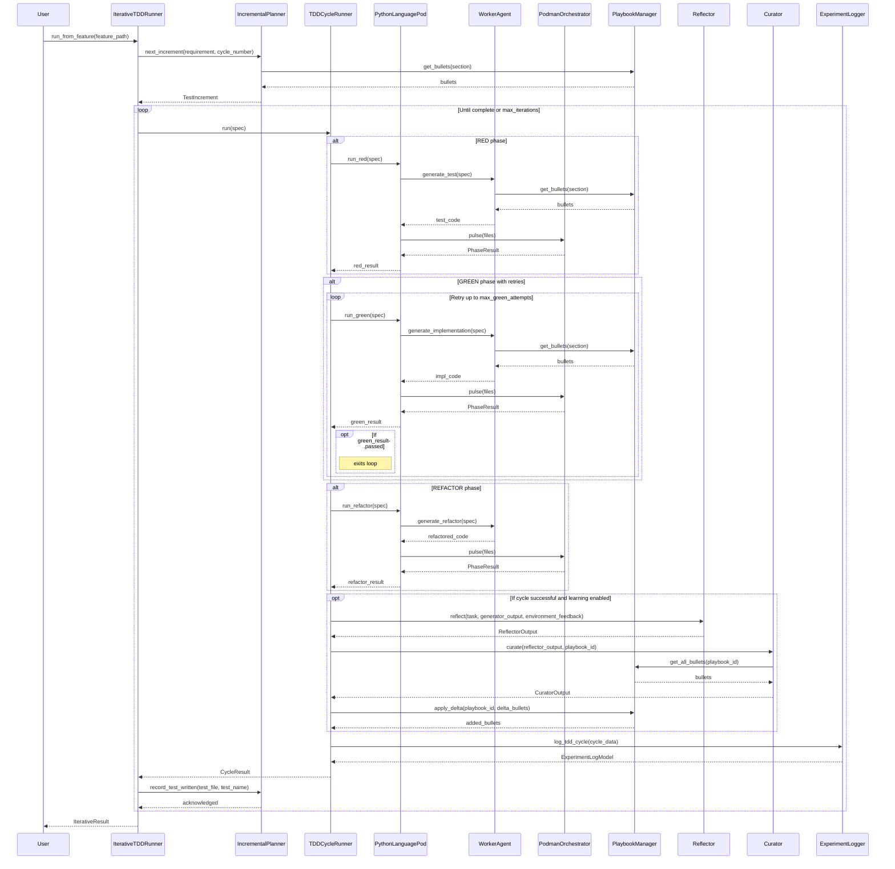

<!-- Generated by generate_live_docs.py on 2026-10-02 05:50 — do not edit by hand -->

# System Architecture

| Component | Module | Role |
|-----------|--------|------|
| TDDCycleRunner | src/agents/tdd_cycle_runner.py | Orchestrates RED→GREEN→REFACTOR for one feature; manages retries, escalation, learning loop |
| IterativeTDDRunner | src/agents/iterative_tdd_runner.py | Kent Beck-style loop: plans increments, runs cycles, repeats until complete |
| IncrementalPlanner | src/agents/incremental_planner.py | Determines next test increment given current state; LLM-driven planning |
| WorkerAgent | src/agents/worker_agent.py | Generates test/implementation/refactor code; retrieves playbook bullets |
| PythonLanguagePod | src/agents/python_language_pod.py | LanguagePod for Python; runs RED/GREEN/REFACTOR phases; manages patch mode |
| PodmanOrchestrator | src/agents/podman_orchestrator.py | Stateless execution layer; sends files to container, validates security |
| PodmanRunner | src/agents/podman_runner.py | ContainerRunner backed by rootless Podman; manages sandbox lifecycle |
| PlaybookManager | src/playbook/manager.py | Core playbook operations: create, retrieve, add bullets, apply deltas, persist |
| ExperimentLogger | src/storage/experiment_logger.py | Logs TDD cycles and ML experiments; PostgreSQL with SQLite fallback |
| Reflector | src/core/reflector/module.py | Analyzes task outcomes; extracts error patterns, root causes, insights |
| Curator | src/core/curator/module.py | Synthesizes reflector insights into playbook bullets; manages deduplication |
| Generator | src/core/generator/module.py | Executes tasks using playbook-guided LLM; retrieves relevant bullets |
| LLMClient | src/utils/llm_client.py | Unified interface for multiple LLM providers (OpenRouter, Ollama, OpenAI, etc.) |
| PerformanceAggregator | src/broker/performance_aggregator.py | Extracts metrics from audit trail; computes success rates, reliability scores |
| AdaptiveBroker | src/broker/adaptive_broker.py | Routes tasks to best agent based on historical performance and cost |
| BulletRetriever | src/playbook/retrieval.py | Hybrid retrieval system; semantic + keyword matching for bullet selection |
| ContextGraphRetriever | src/retrieval/cgr3_retriever.py | CGR³ pipeline: context-aware ranking and reasoning for pattern applicability |
| InstitutionalKnowledgeService | src/retrieval/service.py | Central knowledge retrieval service; coordinates playbook access and filtering |
| AuditStore | src/audit/store.py | Append-only audit event store with hash-chain integrity verification |
| LocalAuditClient | src/audit/local_client.py | Audit client writing directly to local SQLite database |
| ProjectBuilder | src/cli/project_builder.py | Drives ModuleArchitect + ModuleTDDBuilder over ProjectPlan in dependency order |
| ModuleArchitect | src/contracts/module_architect.py | Generates module-level contracts for stateful systems from requirements |
| ModuleTDDBuilder | src/contracts/module_tdd_builder.py | Builds module implementations using TDD; manages function-level iteration |
| ContractValidator | src/contracts/contract_driven.py | Validates implementations against contracts inside sandboxed environment |
| EnsembleLearner | src/ensemble/learner.py | Orchestrates multi-model learning; voting, deliberation, consensus synthesis |
| DistillationRouter | src/playbook/distillation_router.py | Routes tasks to domain-specific distillation playbooks; provenance-aware |
| DashboardApp | src/ui/dashboard.py | Real-time mission-control TUI; renders execution stream and playbook deltas |
| RedundancyPreChecker | src/agents/redundancy_checker.py | Pre-checks proposed tests for redundancy before RED phase execution |

```mermaid
sequenceDiagram
    participant User
    participant IterativeTDDRunner as IterativeTDDRunner
    participant IncrementalPlanner as IncrementalPlanner
    participant TDDCycleRunner as TDDCycleRunner
    participant PythonLanguagePod as PythonLanguagePod
    participant WorkerAgent as WorkerAgent
    participant PodmanOrchestrator as PodmanOrchestrator
    participant PlaybookManager as PlaybookManager
    participant Reflector as Reflector
    participant Curator as Curator
    participant ExperimentLogger as ExperimentLogger

    User->>IterativeTDDRunner: run_from_feature(feature_path)
    IterativeTDDRunner->>IncrementalPlanner: next_increment(requirement, cycle_number)
    IncrementalPlanner->>PlaybookManager: get_bullets(section)
    PlaybookManager-->>IncrementalPlanner: bullets
    IncrementalPlanner-->>IterativeTDDRunner: TestIncrement

    loop Until complete or max_iterations
        IterativeTDDRunner->>TDDCycleRunner: run(spec)
        
        alt RED phase
            TDDCycleRunner->>PythonLanguagePod: run_red(spec)
            PythonLanguagePod->>WorkerAgent: generate_test(spec)
            WorkerAgent->>PlaybookManager: get_bullets(section)
            PlaybookManager-->>WorkerAgent: bullets
            WorkerAgent-->>PythonLanguagePod: test_code
            PythonLanguagePod->>PodmanOrchestrator: pulse(files)
            PodmanOrchestrator-->>PythonLanguagePod: PhaseResult
            PythonLanguagePod-->>TDDCycleRunner: red_result
        end

        alt GREEN phase with retries
            loop Retry up to max_green_attempts
                TDDCycleRunner->>PythonLanguagePod: run_green(spec)
                PythonLanguagePod->>WorkerAgent: generate_implementation(spec)
                WorkerAgent->>PlaybookManager: get_bullets(section)
                PlaybookManager-->>WorkerAgent: bullets
                WorkerAgent-->>PythonLanguagePod: impl_code
                PythonLanguagePod->>PodmanOrchestrator: pulse(files)
                PodmanOrchestrator-->>PythonLanguagePod: PhaseResult
                PythonLanguagePod-->>TDDCycleRunner: green_result
                opt If green_result.passed
                    Note right of TDDCycleRunner: exits loop
                end
            end
        end

        alt REFACTOR phase
            TDDCycleRunner->>PythonLanguagePod: run_refactor(spec)
            PythonLanguagePod->>WorkerAgent: generate_refactor(spec)
            WorkerAgent-->>PythonLanguagePod: refactored_code
            PythonLanguagePod->>PodmanOrchestrator: pulse(files)
            PodmanOrchestrator-->>PythonLanguagePod: PhaseResult
            PythonLanguagePod-->>TDDCycleRunner: refactor_result
        end

        opt If cycle successful and learning enabled
            TDDCycleRunner->>Reflector: reflect(task, generator_output, environment_feedback)
            Reflector-->>TDDCycleRunner: ReflectorOutput
            TDDCycleRunner->>Curator: curate(reflector_output, playbook_id)
            Curator->>PlaybookManager: get_all_bullets(playbook_id)
            PlaybookManager-->>Curator: bullets
            Curator-->>TDDCycleRunner: CuratorOutput
            TDDCycleRunner->>PlaybookManager: apply_delta(playbook_id, delta_bullets)
            PlaybookManager-->>TDDCycleRunner: added_bullets
        end

        TDDCycleRunner->>ExperimentLogger: log_tdd_cycle(cycle_data)
        ExperimentLogger-->>TDDCycleRunner: ExperimentLogModel
        TDDCycleRunner-->>IterativeTDDRunner: CycleResult

        IterativeTDDRunner->>IncrementalPlanner: record_test_written(test_file, test_name)
        IncrementalPlanner-->>IterativeTDDRunner: acknowledged
    end

    IterativeTDDRunner-->>User: IterativeResult
```
