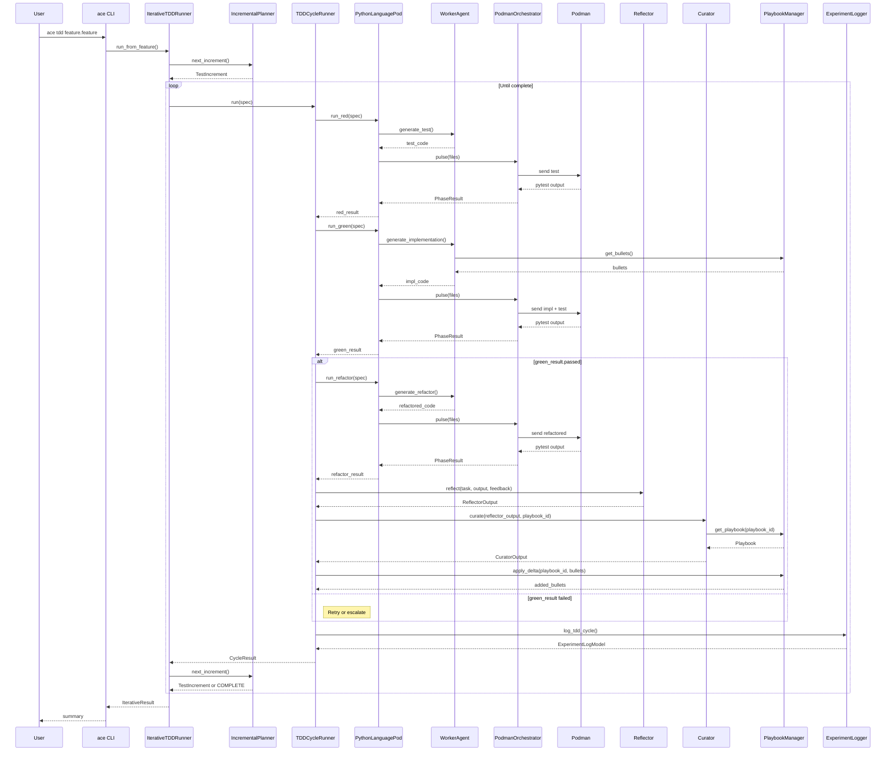

<!-- Generated by generate_live_docs.py on 2026-10-01 23:03 — do not edit by hand -->

# System Architecture

| Component | Module | Role |
|-----------|--------|------|
| TDDCycleRunner | src/agents/tdd_cycle_runner.py | Orchestrates RED→GREEN→REFACTOR for one feature; manages retries, escalation, learning loop, and audit trail |
| IterativeTDDRunner | src/agents/iterative_tdd_runner.py | Kent Beck-style loop: plans increments, runs cycles, repeats until complete |
| IncrementalPlanner | src/agents/incremental_planner.py | Determines next test increment given current state; LLM-driven planning |
| WorkerAgent | src/agents/worker_agent.py | Generates test/implementation/refactor code; retrieves playbook bullets; manages token tracking |
| PythonLanguagePod | src/agents/python_language_pod.py | Python TDD pod; RED/GREEN/REFACTOR phases; patch-mode support; protected shape enforcement |
| PodmanOrchestrator | src/agents/podman_orchestrator.py | Stateless execution layer; sends files to container; validates hash chain; returns phase results |
| PodmanRunner | src/agents/podman_runner.py | Rootless Podman container management; file I/O; test execution; security scanning |
| PlaybookManager | src/playbook/manager.py | Playbook CRUD; bullet deduplication; token budget; content safety screening; persistence |
| ExperimentLogger | src/storage/experiment_logger.py | Logs TDD cycles and ML experiments; PostgreSQL with SQLite fallback; model attribution |
| Reflector | src/core/reflector/module.py | Analyzes task outcomes; extracts error patterns, root causes, key insights; iterative refinement |
| Curator | src/core/curator/module.py | Synthesizes reflector insights into playbook bullets; manages supersedes relationships; applies updates |
| Generator | src/core/generator/module.py | Executes tasks using playbook context; retrieves bullets; tracks usage and feedback |
| GherkinFeatureBridge | src/agents/gherkin_feature_bridge.py | Parses .feature files into FeatureSpec; extracts scenarios and dependencies |
| CharacterizationTestGenerator | src/agents/characterization_test_generator.py | Drafts, verifies, and repairs pytest characterization suites |
| EnsembleBuildRunner | src/agents/ensemble_build.py | Multi-candidate blind build; consensus analysis; winner selection; ensemble learning |
| PolyglotTDDRunner | src/agents/polyglot_tdd_runner.py | Orchestrates RED→GREEN→REFACTOR across multiple language pods |
| ModuleArchitect | src/contracts/module_architect.py | Generates module-level contracts for stateful systems; validates consistency |
| ModuleTDDBuilder | src/contracts/module_tdd_builder.py | Builds module implementations using TDD; integration test validation |
| ProjectArchitect | src/contracts/project_architect.py | Decomposes project spec into module DAG; generates ProjectPlan |
| ProjectBuilder | src/cli/project_builder.py | Drives ModuleArchitect + ModuleTDDBuilder over ProjectPlan in dependency order |
| AdaptiveBroker | src/broker/adaptive_broker.py | Routes tasks to best agent based on historical performance; cost-aware routing |
| PerformanceAggregator | src/broker/performance_aggregator.py | Extracts metrics from audit trail; computes reliability and variance-adjusted scores |
| BlindEvaluator | src/benchmark/blind_evaluation.py | Scores outputs without knowing agent identity; rubric-based evaluation |
| PlaybookReliabilityAnalyzer | src/reliability/playbook_analyzer.py | Correlates bullet retrieval with first-pass GREEN success; computes uplift |
| TDDCycleAnalyzer | src/reliability/tdd_cycle_analyzer.py | Measures first-pass rate and trend over time |
| ContextGraphRetriever | src/retrieval/cgr3_retriever.py | CGR³ pipeline: retrieve, rank, reason; context-aware bullet selection |
| InstitutionalKnowledgeService | src/retrieval/service.py | Central knowledge retrieval service; guidance for TDD and implementation |
| AuditStore | src/audit/store.py | Append-only audit event store with hash chain integrity verification |
| LocalAuditClient | src/audit/local_client.py | Audit client writing directly to local SQLite database |
| DriftDetector | src/utils/file_lock.py | Detects inadvertent file drift; enforces clean workspace |

```mermaid
sequenceDiagram
    participant User
    participant CLI as ace CLI
    participant Runner as IterativeTDDRunner
    participant Planner as IncrementalPlanner
    participant Cycle as TDDCycleRunner
    participant Pod as PythonLanguagePod
    participant Worker as WorkerAgent
    participant Orchestrator as PodmanOrchestrator
    participant Container as Podman
    participant Reflector as Reflector
    participant Curator as Curator
    participant Manager as PlaybookManager
    participant Logger as ExperimentLogger

    User->>CLI: ace tdd feature.feature
    CLI->>Runner: run_from_feature()
    Runner->>Planner: next_increment()
    Planner-->>Runner: TestIncrement
    loop Until complete
        Runner->>Cycle: run(spec)
        Cycle->>Pod: run_red(spec)
        Pod->>Worker: generate_test()
        Worker-->>Pod: test_code
        Pod->>Orchestrator: pulse(files)
        Orchestrator->>Container: send test
        Container-->>Orchestrator: pytest output
        Orchestrator-->>Pod: PhaseResult
        Pod-->>Cycle: red_result
        Cycle->>Pod: run_green(spec)
        Pod->>Worker: generate_implementation()
        Worker->>Manager: get_bullets()
        Manager-->>Worker: bullets
        Worker-->>Pod: impl_code
        Pod->>Orchestrator: pulse(files)
        Orchestrator->>Container: send impl + test
        Container-->>Orchestrator: pytest output
        Orchestrator-->>Pod: PhaseResult
        Pod-->>Cycle: green_result
        alt green_result.passed
            Cycle->>Pod: run_refactor(spec)
            Pod->>Worker: generate_refactor()
            Worker-->>Pod: refactored_code
            Pod->>Orchestrator: pulse(files)
            Orchestrator->>Container: send refactored
            Container-->>Orchestrator: pytest output
            Orchestrator-->>Pod: PhaseResult
            Pod-->>Cycle: refactor_result
            Cycle->>Reflector: reflect(task, output, feedback)
            Reflector-->>Cycle: ReflectorOutput
            Cycle->>Curator: curate(reflector_output, playbook_id)
            Curator->>Manager: get_playbook(playbook_id)
            Manager-->>Curator: Playbook
            Curator-->>Cycle: CuratorOutput
            Cycle->>Manager: apply_delta(playbook_id, bullets)
            Manager-->>Cycle: added_bullets
        else green_result failed
            Note right of Cycle: Retry or escalate
        end
        Cycle->>Logger: log_tdd_cycle()
        Logger-->>Cycle: ExperimentLogModel
        Cycle-->>Runner: CycleResult
        Runner->>Planner: next_increment()
        Planner-->>Runner: TestIncrement or COMPLETE
    end
    Runner-->>CLI: IterativeResult
    CLI-->>User: summary
```
