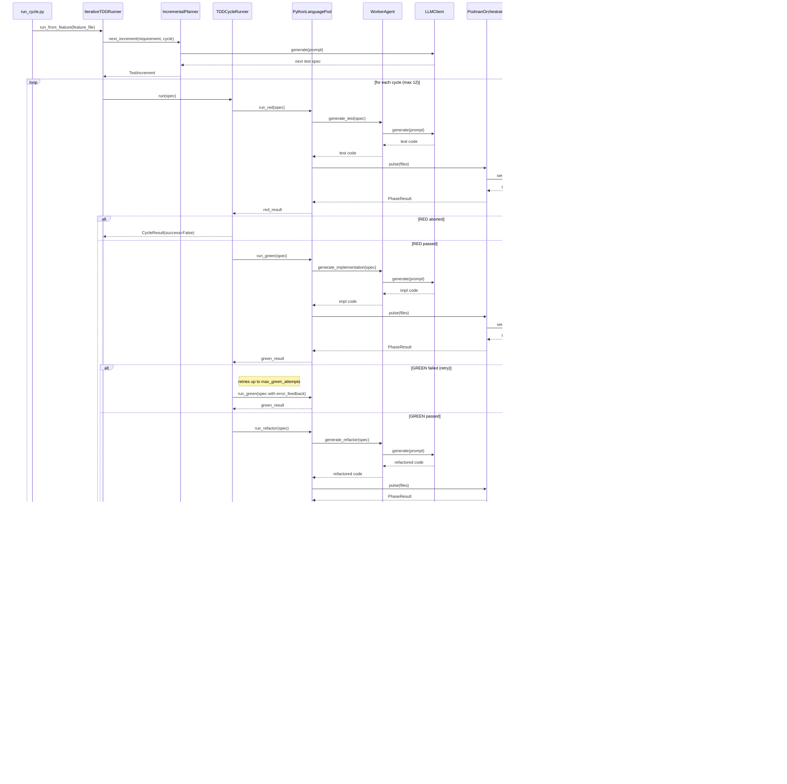

<!-- Generated by generate_live_docs.py on 2026-10-01 05:19 — do not edit by hand -->

# System Architecture

| Component | Module | Role |
|-----------|--------|------|
| LLMClient | src/utils/llm_client.py | Unified LLM provider interface |
| WorkerAgent | src/agents/worker_agent.py | Code generation for TDD phases |
| PythonLanguagePod | src/agents/python_language_pod.py | Python TDD execution pod |
| PodmanOrchestrator | src/agents/podman_orchestrator.py | Sandboxed container execution |
| PodmanRunner | src/agents/podman_runner.py | Rootless Podman container runner |
| TDDCycleRunner | src/agents/tdd_cycle_runner.py | RED→GREEN→REFACTOR cycle orchestrator |
| IterativeTDDRunner | src/agents/iterative_tdd_runner.py | Iterative TDD loop with planner |
| IncrementalPlanner | src/agents/incremental_planner.py | Next test increment planner |
| PlaybookManager | src/playbook/manager.py | Playbook CRUD and persistence |
| BulletRetriever | src/playbook/retrieval.py | Hybrid bullet retrieval engine |
| ContextGraphRetriever | src/retrieval/cgr3_retriever.py | CGR³ context-aware retrieval |
| ContextScorer | src/retrieval/context_scorer.py | Multi-dimension context scoring |
| InstitutionalKnowledgeService | src/retrieval/service.py | Central knowledge retrieval service |
| Generator | src/core/generator/module.py | Playbook-guided task execution |
| Reflector | src/core/reflector/module.py | Task outcome analysis and insight extraction |
| Curator | src/core/curator/module.py | Insight-to-playbook-bullet synthesis |
| ExperimentLogger | src/storage/experiment_logger.py | TDD/ML experiment persistence |
| PerformanceAggregator | src/broker/performance_aggregator.py | Audit-trail metric aggregation |
| AdaptiveBroker | src/broker/adaptive_broker.py | Performance-based task routing |
| PlaybookReliabilityAnalyzer | src/reliability/playbook_analyzer.py | Bullet-to-GREEN-success correlation |
| TDDCycleAnalyzer | src/reliability/tdd_cycle_analyzer.py | First-pass GREEN rate analysis |
| ImportFilter | src/agents/import_filter.py | Static import/call security filter |
| EnsembleBuildRunner | src/agents/ensemble_build.py | Multi-candidate blind feature build |
| ModuleArchitect | src/contracts/module_architect.py | Module-level contract generation |
| ModuleTDDBuilder | src/contracts/module_tdd_builder.py | Contract-driven TDD module builder |
| ProjectArchitect | src/contracts/project_architect.py | Project spec to module DAG decomposition |
| ProjectBuilder | src/cli/project_builder.py | Ordered module build orchestration |
| PolyglotTDDRunner | src/agents/polyglot_tdd_runner.py | Multi-language TDD orchestration |
| SimulationOracle | src/agents/simulation_oracle.py | Physics simulation test oracle |
| SimulationPod | src/agents/simulation_pod.py | PyBullet-backed TDD execution pod |
| LocalAuditClient | src/audit/local_client.py | Local SQLite audit trail writer |
| AuditStore | src/audit/store.py | Append-only hash-chained audit store |

```mermaid
sequenceDiagram
    participant Main as run_cycle.py
    participant ITR as IterativeTDDRunner
    participant Planner as IncrementalPlanner
    participant TCR as TDDCycleRunner
    participant Pod as PythonLanguagePod
    participant Worker as WorkerAgent
    participant LLM as LLMClient
    participant Orch as PodmanOrchestrator
    participant Runner as PodmanRunner
    participant PB as PlaybookManager
    participant Logger as ExperimentLogger
    participant Reflector as Reflector
    participant Curator as Curator

    Main->>ITR: run_from_feature(feature_file)
    ITR->>Planner: next_increment(requirement, cycle)
    Planner->>LLM: generate(prompt)
    LLM-->>Planner: next test spec
    Planner-->>ITR: TestIncrement
    loop for each cycle (max 12)
        ITR->>TCR: run(spec)
        TCR->>Pod: run_red(spec)
        Pod->>Worker: generate_test(spec)
        Worker->>LLM: generate(prompt)
        LLM-->>Worker: test code
        Worker-->>Pod: test code
        Pod->>Orch: pulse(files)
        Orch->>Runner: send_pulse(files)
        Runner-->>Orch: PhaseResult
        Orch-->>Pod: PhaseResult
        Pod-->>TCR: red_result
        alt RED aborted
            TCR-->>ITR: CycleResult(success=False)
        else RED passed
            TCR->>Pod: run_green(spec)
            Pod->>Worker: generate_implementation(spec)
            Worker->>LLM: generate(prompt)
            LLM-->>Worker: impl code
            Worker-->>Pod: impl code
            Pod->>Orch: pulse(files)
            Orch->>Runner: send_pulse(files)
            Runner-->>Orch: PhaseResult
            Orch-->>Pod: PhaseResult
            Pod-->>TCR: green_result
            alt GREEN failed (retry)
                Note right of TCR: retries up to max_green_attempts
                TCR->>Pod: run_green(spec with error_feedback)
                Pod-->>TCR: green_result
            else GREEN passed
                TCR->>Pod: run_refactor(spec)
                Pod->>Worker: generate_refactor(spec)
                Worker->>LLM: generate(prompt)
                LLM-->>Worker: refactored code
                Worker-->>Pod: refactored code
                Pod->>Orch: pulse(files)
                Orch-->>Pod: PhaseResult
                Pod-->>TCR: refactor_result
                TCR->>Reflector: reflect(task, gen_output, env_feedback)
                Reflector->>LLM: generate(analysis_prompt)
                LLM-->>Reflector: analysis
                Reflector-->>TCR: ReflectorOutput
                TCR->>Curator: curate(reflector_output, playbook_id)
                Curator->>LLM: generate(synthesis_prompt)
                LLM-->>Curator: delta bullets
                Curator->>PB: apply_delta(playbook_id, delta_bullets)
                PB-->>Curator: added bullet IDs
                Curator-->>TCR: CuratorOutput
                TCR->>Logger: log_tdd_cycle(...)
                Logger-->>TCR: logged
                TCR-->>ITR: CycleResult(success=True)
            end
        end
        ITR->>Planner: record_test_written(...)
        alt planner says COMPLETE
            ITR-->>Main: IterativeResult(complete=True)
        else continue
            ITR->>Planner: next_increment(...)
            Planner-->>ITR: next TestIncrement
        end
    end
    Main->>Runner: stop()
```
