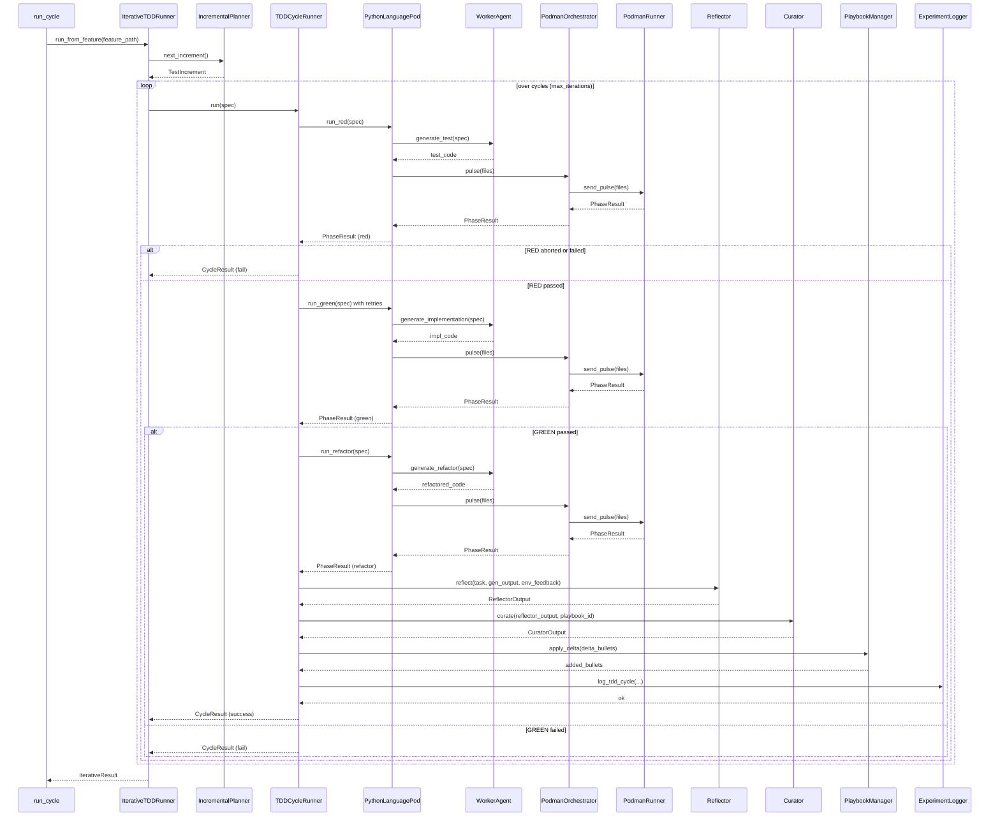

<!-- Generated by generate_live_docs.py on 2026-09-26 19:41 — do not edit by hand -->

# System Architecture

| Component | Module | Role |
|-----------|--------|------|
| IterativeTDDRunner | src/agents/iterative_tdd_runner.py | Orchestrates the RED→GREEN→REFACTOR loop across multiple cycles |
| TDDCycleRunner | src/agents/tdd_cycle_runner.py | Runs one complete TDD cycle with retries and learning |
| PythonLanguagePod | src/agents/python_language_pod.py | LanguagePod for Python TDD cycles, delegates to WorkerAgent and PodmanOrchestrator |
| WorkerAgent | src/agents/worker_agent.py | Generates code for each TDD phase using LLM and playbook context |
| PodmanOrchestrator | src/agents/podman_orchestrator.py | Stateless sidecar execution layer for the Clean Room harness |
| PodmanRunner | src/agents/podman_runner.py | Production ContainerRunner backed by rootless Podman |
| IncrementalPlanner | src/agents/incremental_planner.py | Determines the next test increment given current state |
| PlaybookManager | src/playbook/manager.py | Core playbook operations: creation, updates, merging, retrieval |
| ExperimentLogger | src/storage/experiment_logger.py | Unified logger for TDD and ML experiments with PostgreSQL/SQLite fallback |
| Reflector | src/core/reflector/module.py | Analyzes generator performance and extracts learning insights |
| Curator | src/core/curator/module.py | Synthesizes insights into actionable playbook updates |
| Generator | src/core/generator/module.py | Executes tasks using playbook-guided LLM generation |
| BulletRetriever | src/playbook/retrieval.py | Hybrid retrieval system for selecting relevant bullets |
| ContextGraphRetriever | src/retrieval/cgr3_retriever.py | CGR³: Context Graph Retrieve-Rank-Reason |
| ContextScorer | src/retrieval/context_scorer.py | Scores bullets against request context across multiple dimensions |
| InstitutionalKnowledgeService | src/retrieval/service.py | Central knowledge retrieval service for all code generation activities |
| LLMClient | src/utils/llm_client.py | Unified LLM client supporting multiple providers |
| ImportFilter | src/agents/import_filter.py | Filters forbidden imports and builtins in generated code |
| EnsembleBuildRunner | src/agents/ensemble_build.py | Drives multi-candidate blind build for one feature |
| PolyglotTDDRunner | src/agents/polyglot_tdd_runner.py | Orchestrates RED→GREEN→REFACTOR across multiple LanguagePods |
| ModuleArchitect | src/contracts/module_architect.py | Generates module-level contracts for stateful systems |
| ModuleTDDBuilder | src/contracts/module_tdd_builder.py | Builds module implementations using TDD methodology |
| ProjectArchitect | src/contracts/project_architect.py | Decomposes a project spec into a module DAG |
| ProjectBuilder | src/cli/project_builder.py | Drives ModuleArchitect + ModuleTDDBuilder over a ProjectPlan |
| AdaptiveBroker | src/broker/adaptive_broker.py | Routes tasks based on learned performance |
| PerformanceAggregator | src/broker/performance_aggregator.py | Extracts metrics from audit trail |
| CapabilityRegistry | src/broker/capability_registry.py | Anonymous agent capability tracking |
| BrokerAdvisor | src/broker/advisor.py | Recommends agents by capability fit |
| HumanDecisionInterface | src/broker/human_decision.py | Interface for human decision-making |
| RegressionDetector | src/broker/regression_detector.py | Tracks quality changes across model versions |
| PlaybookReliabilityAnalyzer | src/reliability/playbook_analyzer.py | Correlates bullet retrieval with first-pass GREEN outcomes |
| TDDCycleAnalyzer | src/reliability/tdd_cycle_analyzer.py | Measures first-pass GREEN rate and trend |
| SuccessRateCalculator | src/analytics/success_rate_calculator.py | Measures experiment success rates across the system |
| TokenEfficiencyReporter | src/analytics/token_efficiency.py | Aggregates TokenUsage data from LanguagePods |
| CostQualityAnalyzer | src/analytics/cost_quality_analyzer.py | Analyzes cost-quality tradeoffs for model performance data |

```mermaid
sequenceDiagram
    participant run_cycle as run_cycle
    participant IterativeTDDRunner as IterativeTDDRunner
    participant IncrementalPlanner as IncrementalPlanner
    participant TDDCycleRunner as TDDCycleRunner
    participant PythonLanguagePod as PythonLanguagePod
    participant WorkerAgent as WorkerAgent
    participant PodmanOrchestrator as PodmanOrchestrator
    participant PodmanRunner as PodmanRunner
    participant Reflector as Reflector
    participant Curator as Curator
    participant PlaybookManager as PlaybookManager
    participant ExperimentLogger as ExperimentLogger

    run_cycle->>IterativeTDDRunner: run_from_feature(feature_path)
    IterativeTDDRunner->>IncrementalPlanner: next_increment()
    IncrementalPlanner-->>IterativeTDDRunner: TestIncrement
    loop over cycles (max_iterations)
        IterativeTDDRunner->>TDDCycleRunner: run(spec)
        TDDCycleRunner->>PythonLanguagePod: run_red(spec)
        PythonLanguagePod->>WorkerAgent: generate_test(spec)
        WorkerAgent-->>PythonLanguagePod: test_code
        PythonLanguagePod->>PodmanOrchestrator: pulse(files)
        PodmanOrchestrator->>PodmanRunner: send_pulse(files)
        PodmanRunner-->>PodmanOrchestrator: PhaseResult
        PodmanOrchestrator-->>PythonLanguagePod: PhaseResult
        PythonLanguagePod-->>TDDCycleRunner: PhaseResult (red)
        alt RED aborted or failed
            TDDCycleRunner-->>IterativeTDDRunner: CycleResult (fail)
        else RED passed
            TDDCycleRunner->>PythonLanguagePod: run_green(spec) with retries
            PythonLanguagePod->>WorkerAgent: generate_implementation(spec)
            WorkerAgent-->>PythonLanguagePod: impl_code
            PythonLanguagePod->>PodmanOrchestrator: pulse(files)
            PodmanOrchestrator->>PodmanRunner: send_pulse(files)
            PodmanRunner-->>PodmanOrchestrator: PhaseResult
            PodmanOrchestrator-->>PythonLanguagePod: PhaseResult
            PythonLanguagePod-->>TDDCycleRunner: PhaseResult (green)
            alt GREEN passed
                TDDCycleRunner->>PythonLanguagePod: run_refactor(spec)
                PythonLanguagePod->>WorkerAgent: generate_refactor(spec)
                WorkerAgent-->>PythonLanguagePod: refactored_code
                PythonLanguagePod->>PodmanOrchestrator: pulse(files)
                PodmanOrchestrator->>PodmanRunner: send_pulse(files)
                PodmanRunner-->>PodmanOrchestrator: PhaseResult
                PodmanOrchestrator-->>PythonLanguagePod: PhaseResult
                PythonLanguagePod-->>TDDCycleRunner: PhaseResult (refactor)
                TDDCycleRunner->>Reflector: reflect(task, gen_output, env_feedback)
                Reflector-->>TDDCycleRunner: ReflectorOutput
                TDDCycleRunner->>Curator: curate(reflector_output, playbook_id)
                Curator-->>TDDCycleRunner: CuratorOutput
                TDDCycleRunner->>PlaybookManager: apply_delta(delta_bullets)
                PlaybookManager-->>TDDCycleRunner: added_bullets
                TDDCycleRunner->>ExperimentLogger: log_tdd_cycle(...)
                ExperimentLogger-->>TDDCycleRunner: ok
                TDDCycleRunner-->>IterativeTDDRunner: CycleResult (success)
            else GREEN failed
                TDDCycleRunner-->>IterativeTDDRunner: CycleResult (fail)
            end
        end
    end
    IterativeTDDRunner-->>run_cycle: IterativeResult
```
