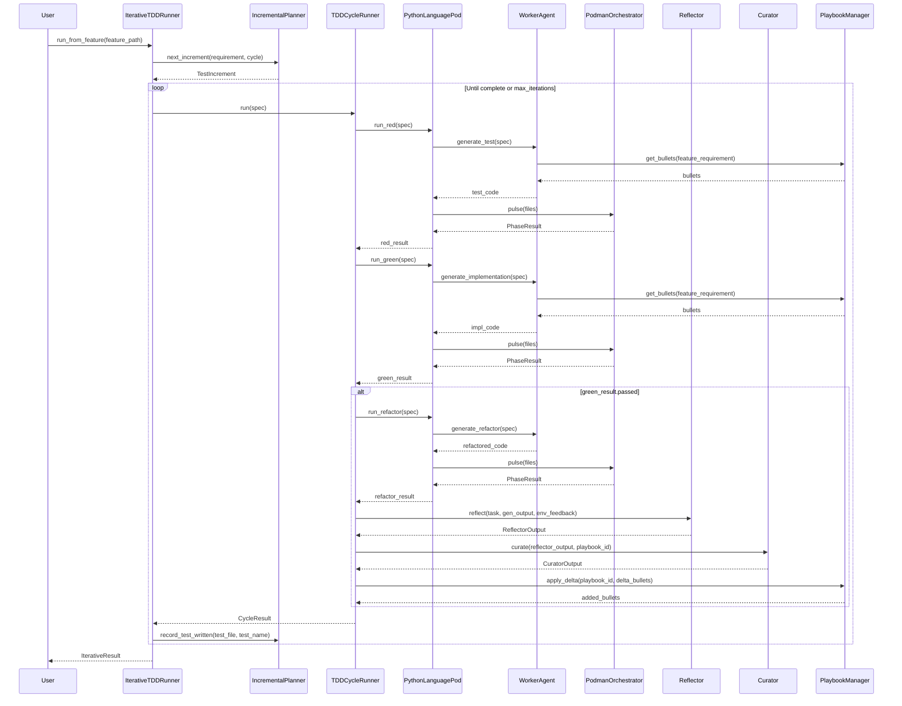

<!-- Generated by generate_live_docs.py on 2026-10-01 06:27 — do not edit by hand -->

# System Architecture

| Component | Module | Role |
|-----------|--------|------|
| IterativeTDDRunner | src/agents/iterative_tdd_runner.py | Orchestrates RED→GREEN→REFACTOR loop; drives TDD cycles until completion |
| TDDCycleRunner | src/agents/tdd_cycle_runner.py | Executes one complete TDD cycle with retry logic, learning, and audit trail |
| PythonLanguagePod | src/agents/python_language_pod.py | LanguagePod implementation for Python; manages RED/GREEN/REFACTOR phases |
| WorkerAgent | src/agents/worker_agent.py | Generates test/implementation/refactor code via LLM; retrieves playbook bullets |
| PodmanOrchestrator | src/agents/podman_orchestrator.py | Stateless sidecar execution layer; runs code in sandboxed containers |
| PodmanRunner | src/agents/podman_runner.py | ContainerRunner backed by rootless Podman; manages container lifecycle |
| IncrementalPlanner | src/agents/incremental_planner.py | Determines next test increment; plans TDD steps from requirements |
| PlaybookManager | src/playbook/manager.py | Core playbook operations: creation, updates, merging, retrieval, deduplication |
| Reflector | src/core/reflector/module.py | Analyzes task outcomes; extracts error patterns, root causes, insights |
| Curator | src/core/curator/module.py | Synthesizes reflector insights into actionable playbook bullets |
| Generator | src/core/generator/module.py | Executes tasks using playbook-guided LLM; tracks bullet usage |
| ExperimentLogger | src/storage/experiment_logger.py | Unified logger for TDD and ML experiments; persists to PostgreSQL/SQLite |
| LLMClient | src/utils/llm_client.py | Unified interface for multiple LLM providers (OpenRouter, Ollama, OpenAI, etc.) |
| PolyglotTDDRunner | src/agents/polyglot_tdd_runner.py | Orchestrates RED→GREEN→REFACTOR across multiple language pods |
| EnsembleBuildRunner | src/agents/ensemble_build.py | Multi-candidate blind build; drives consensus and ensemble learning |
| AdaptiveBroker | src/broker/adaptive_broker.py | Routes tasks to best agent based on learned performance metrics |
| PerformanceAggregator | src/broker/performance_aggregator.py | Extracts and aggregates performance metrics from audit trail |
| ProjectBuilder | src/cli/project_builder.py | Drives ModuleArchitect + ModuleTDDBuilder over a ProjectPlan |
| ModuleArchitect | src/contracts/module_architect.py | Generates module-level contracts for stateful systems |
| ModuleTDDBuilder | src/contracts/module_tdd_builder.py | Builds module implementations using TDD methodology |
| ContractOrchestrator | src/contracts/contract_driven.py | Orchestrates contract-driven development across agents |
| BlindEvaluator | src/benchmark/blind_evaluation.py | Scores outputs without knowing which agent produced them |
| ProductionDataAnalyzer | src/benchmark/production_analyzer.py | Analyzes quality data from experiment logs; extracts model performance |
| AuditStore | src/audit/store.py | Append-only audit event store with hash chain integrity |
| LocalAuditClient | src/audit/local_client.py | Audit client that writes directly to local SQLite database |
| DistillationRouter | src/playbook/distillation_router.py | Routes tasks to domain-specific distillation playbooks |
| InstitutionalKnowledgeService | src/retrieval/service.py | Central knowledge retrieval service for code generation activities |
| ContextGraphRetriever | src/retrieval/cgr3_retriever.py | CGR³ context-aware retrieval with reasoning and ranking |
| CharacterizationTestGenerator | src/agents/characterization_test_generator.py | Writes empirically-verified pytest characterization suites |
| GherkinExtractionAgent | src/agents/gherkin_extraction_agent.py | Reverse engineers Gherkin scenarios from existing code and tests |
| RedundancyPreChecker | src/agents/redundancy_checker.py | Pre-checks proposed tests for redundancy before RED phase |

```mermaid
sequenceDiagram
    participant User
    participant IterativeTDDRunner
    participant IncrementalPlanner
    participant TDDCycleRunner
    participant PythonLanguagePod
    participant WorkerAgent
    participant PodmanOrchestrator
    participant Reflector
    participant Curator
    participant PlaybookManager

    User->>IterativeTDDRunner: run_from_feature(feature_path)
    IterativeTDDRunner->>IncrementalPlanner: next_increment(requirement, cycle)
    IncrementalPlanner-->>IterativeTDDRunner: TestIncrement
    
    loop Until complete or max_iterations
        IterativeTDDRunner->>TDDCycleRunner: run(spec)
        
        TDDCycleRunner->>PythonLanguagePod: run_red(spec)
        PythonLanguagePod->>WorkerAgent: generate_test(spec)
        WorkerAgent->>PlaybookManager: get_bullets(feature_requirement)
        PlaybookManager-->>WorkerAgent: bullets
        WorkerAgent-->>PythonLanguagePod: test_code
        PythonLanguagePod->>PodmanOrchestrator: pulse(files)
        PodmanOrchestrator-->>PythonLanguagePod: PhaseResult
        PythonLanguagePod-->>TDDCycleRunner: red_result
        
        TDDCycleRunner->>PythonLanguagePod: run_green(spec)
        PythonLanguagePod->>WorkerAgent: generate_implementation(spec)
        WorkerAgent->>PlaybookManager: get_bullets(feature_requirement)
        PlaybookManager-->>WorkerAgent: bullets
        WorkerAgent-->>PythonLanguagePod: impl_code
        PythonLanguagePod->>PodmanOrchestrator: pulse(files)
        PodmanOrchestrator-->>PythonLanguagePod: PhaseResult
        PythonLanguagePod-->>TDDCycleRunner: green_result
        
        alt green_result.passed
            TDDCycleRunner->>PythonLanguagePod: run_refactor(spec)
            PythonLanguagePod->>WorkerAgent: generate_refactor(spec)
            WorkerAgent-->>PythonLanguagePod: refactored_code
            PythonLanguagePod->>PodmanOrchestrator: pulse(files)
            PodmanOrchestrator-->>PythonLanguagePod: PhaseResult
            PythonLanguagePod-->>TDDCycleRunner: refactor_result
            
            TDDCycleRunner->>Reflector: reflect(task, gen_output, env_feedback)
            Reflector-->>TDDCycleRunner: ReflectorOutput
            TDDCycleRunner->>Curator: curate(reflector_output, playbook_id)
            Curator-->>TDDCycleRunner: CuratorOutput
            TDDCycleRunner->>PlaybookManager: apply_delta(playbook_id, delta_bullets)
            PlaybookManager-->>TDDCycleRunner: added_bullets
        end
        
        TDDCycleRunner-->>IterativeTDDRunner: CycleResult
        IterativeTDDRunner->>IncrementalPlanner: record_test_written(test_file, test_name)
    end
    
    IterativeTDDRunner-->>User: IterativeResult
```
