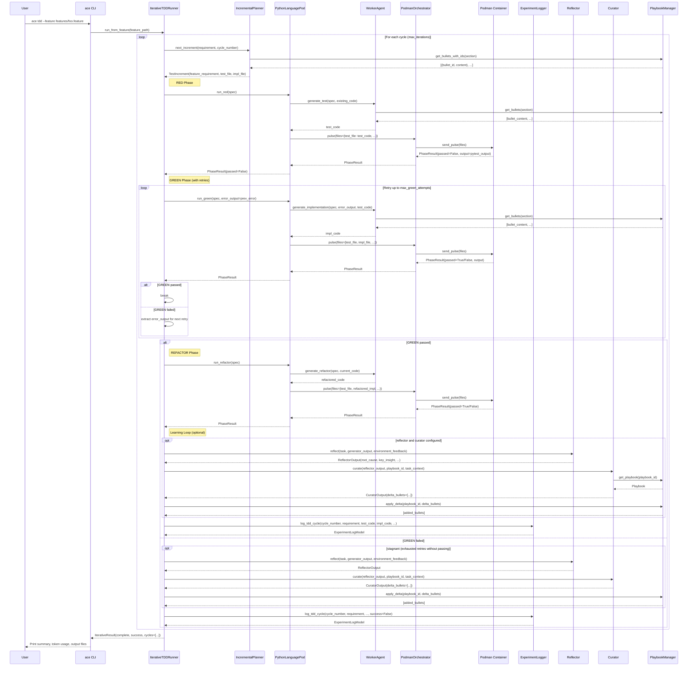

<!-- Generated by generate_live_docs.py on 2026-10-01 17:41 — do not edit by hand -->

# System Architecture

| Component | Module | Role |
|-----------|--------|------|
| TDDCycleRunner | src/agents/tdd_cycle_runner.py | Orchestrates RED→GREEN→REFACTOR phases for one feature; manages retries, escalation, learning loop |
| IterativeTDDRunner | src/agents/iterative_tdd_runner.py | Drives multi-cycle TDD loop; plans increments, coordinates pod execution, aggregates results |
| IncrementalPlanner | src/agents/incremental_planner.py | Determines next test increment via LLM; tracks written tests and implementation context |
| WorkerAgent | src/agents/worker_agent.py | Generates test/implementation/refactor code; retrieves playbook bullets; manages token tracking |
| PythonLanguagePod | src/agents/python_language_pod.py | Python TDD pod; runs RED/GREEN/REFACTOR; handles patching, imports, file I/O |
| PodmanOrchestrator | src/agents/podman_orchestrator.py | Stateless execution layer; sends files to container, validates hash chain, returns results |
| PodmanRunner | src/agents/podman_runner.py | Rootless Podman container management; starts/stops sandbox, executes test pulses |
| PlaybookManager | src/playbook/manager.py | Manages playbook CRUD, delta updates, deduplication, token budgets, persistence |
| ExperimentLogger | src/storage/experiment_logger.py | Logs TDD cycles and ML experiments; PostgreSQL with SQLite fallback |
| Reflector | src/core/reflector/module.py | Analyzes task outcomes; extracts error patterns, root causes, key insights |
| Curator | src/core/curator/module.py | Synthesizes reflector insights into playbook bullets; manages supersedes relationships |
| Generator | src/core/generator/module.py | Executes tasks using playbook context; retrieves bullets, tracks usage |
| PolyglotTDDRunner | src/agents/polyglot_tdd_runner.py | Orchestrates RED→GREEN→REFACTOR across multiple languages |
| PodFactory | src/agents/polyglot_tdd_runner.py | Creates language-specific LanguagePod instances |
| ModuleArchitect | src/contracts/module_architect.py | Generates module-level contracts from requirements; formats context |
| ModuleTDDBuilder | src/contracts/module_tdd_builder.py | Builds module implementations via TDD; manages function-level iteration |
| ProjectArchitect | src/contracts/project_architect.py | Decomposes project spec into module DAG; orders dependencies |
| ProjectBuilder | src/cli/project_builder.py | Drives ModuleArchitect + ModuleTDDBuilder over ProjectPlan; manages build state |
| AdaptiveBroker | src/broker/adaptive_broker.py | Routes tasks to best agent based on historical performance metrics |
| PerformanceAggregator | src/broker/performance_aggregator.py | Extracts performance metrics from audit trail; computes reliability scores |
| BrokerAdvisor | src/broker/advisor.py | Recommends agents by capability fit for task requirements |
| AuditStore | src/audit/store.py | Append-only hash-chained audit event store; verifies integrity |
| LocalAuditClient | src/audit/local_client.py | Writes audit events to local SQLite database |
| BlindEvaluator | src/benchmark/blind_evaluation.py | Scores code outputs without knowing agent identity; runs tests in sandbox |
| ProductionDataAnalyzer | src/benchmark/production_analyzer.py | Analyzes quality metrics from experiment logs; generates performance reports |
| PlaybookReliabilityAnalyzer | src/reliability/playbook_analyzer.py | Correlates bullet retrieval with first-pass GREEN success; computes uplift |
| TDDCycleAnalyzer | src/reliability/tdd_cycle_analyzer.py | Measures first-pass rate and trend over time |
| InstitutionalKnowledgeService | src/retrieval/service.py | Central knowledge retrieval service; routes to CGR³ or fallback retrieval |
| ContextGraphRetriever | src/retrieval/cgr3_retriever.py | CGR³ pipeline: retrieve, rank by context, reason about applicability |
| ContextScorer | src/retrieval/context_scorer.py | Scores bullets against request context (temporal, team, tech stack, project, domain) |
| DistillationRouter | src/playbook/distillation_router.py | Routes tasks to domain-specific distillation playbooks; manages provenance |
| DashboardApp | src/ui/dashboard.py | Real-time mission-control TUI; listens for broadcast events, renders live state |
| ContractOrchestrator | src/contracts/contract_driven.py | Orchestrates contract-driven development; manages contract registration and validation |
| EnsembleLearner | src/ensemble/learner.py | Ensemble learning system; executes models in parallel, conducts voting and deliberation |
| ConsensusBuilder | src/ensemble/consensus.py | Builds consensus from multiple model proposals; clusters and merges bullets |

```mermaid
sequenceDiagram
    participant User
    participant CLI as ace CLI
    participant Runner as IterativeTDDRunner
    participant Planner as IncrementalPlanner
    participant Pod as PythonLanguagePod
    participant Worker as WorkerAgent
    participant Orchestrator as PodmanOrchestrator
    participant Container as Podman Container
    participant Logger as ExperimentLogger
    participant Reflector
    participant Curator
    participant PlaybookMgr as PlaybookManager

    User->>CLI: ace tdd --feature features/foo.feature
    CLI->>Runner: run_from_feature(feature_path)
    
    loop For each cycle (max_iterations)
        Runner->>Planner: next_increment(requirement, cycle_number)
        Planner->>PlaybookMgr: get_bullets_with_ids(section)
        PlaybookMgr-->>Planner: [(bullet_id, content), ...]
        Planner-->>Runner: TestIncrement(feature_requirement, test_file, impl_file)
        
        Note right of Runner: RED Phase
        Runner->>Pod: run_red(spec)
        Pod->>Worker: generate_test(spec, existing_code)
        Worker->>PlaybookMgr: get_bullets(section)
        PlaybookMgr-->>Worker: [bullet_content, ...]
        Worker-->>Pod: test_code
        Pod->>Orchestrator: pulse(files={test_file: test_code, ...})
        Orchestrator->>Container: send_pulse(files)
        Container-->>Orchestrator: PhaseResult(passed=False, output=pytest_output)
        Orchestrator-->>Pod: PhaseResult
        Pod-->>Runner: PhaseResult(passed=False)
        
        Note right of Runner: GREEN Phase (with retries)
        loop Retry up to max_green_attempts
            Runner->>Pod: run_green(spec, error_output=prev_error)
            Pod->>Worker: generate_implementation(spec, error_output, test_code)
            Worker->>PlaybookMgr: get_bullets(section)
            PlaybookMgr-->>Worker: [bullet_content, ...]
            Worker-->>Pod: impl_code
            Pod->>Orchestrator: pulse(files={test_file, impl_file, ...})
            Orchestrator->>Container: send_pulse(files)
            Container-->>Orchestrator: PhaseResult(passed=True/False, output)
            Orchestrator-->>Pod: PhaseResult
            Pod-->>Runner: PhaseResult
            alt GREEN passed
                Runner->>Runner: break
            else GREEN failed
                Runner->>Runner: extract error_output for next retry
            end
        end
        
        alt GREEN passed
            Note right of Runner: REFACTOR Phase
            Runner->>Pod: run_refactor(spec)
            Pod->>Worker: generate_refactor(spec, current_code)
            Worker-->>Pod: refactored_code
            Pod->>Orchestrator: pulse(files={test_file, refactored_impl, ...})
            Orchestrator->>Container: send_pulse(files)
            Container-->>Orchestrator: PhaseResult(passed=True/False)
            Orchestrator-->>Pod: PhaseResult
            Pod-->>Runner: PhaseResult
            
            Note right of Runner: Learning Loop (optional)
            opt reflector and curator configured
                Runner->>Reflector: reflect(task, generator_output, environment_feedback)
                Reflector-->>Runner: ReflectorOutput(root_cause, key_insight, ...)
                Runner->>Curator: curate(reflector_output, playbook_id, task_context)
                Curator->>PlaybookMgr: get_playbook(playbook_id)
                PlaybookMgr-->>Curator: Playbook
                Curator-->>Runner: CuratorOutput(delta_bullets=[...])
                Runner->>PlaybookMgr: apply_delta(playbook_id, delta_bullets)
                PlaybookMgr-->>Runner: [added_bullets]
            end
            
            Runner->>Logger: log_tdd_cycle(cycle_number, requirement, test_code, impl_code, ...)
            Logger-->>Runner: ExperimentLogModel
        else GREEN failed
            opt stagnant (exhausted retries without passing)
                Runner->>Reflector: reflect(task, generator_output, environment_feedback)
                Reflector-->>Runner: ReflectorOutput
                Runner->>Curator: curate(reflector_output, playbook_id, task_context)
                Curator-->>Runner: CuratorOutput(delta_bullets=[...])
                Runner->>PlaybookMgr: apply_delta(playbook_id, delta_bullets)
                PlaybookMgr-->>Runner: [added_bullets]
            end
            Runner->>Logger: log_tdd_cycle(cycle_number, requirement, ..., success=False)
            Logger-->>Runner: ExperimentLogModel
        end
    end
    
    Runner-->>CLI: IterativeResult(complete, success, cycles=[...])
    CLI-->>User: Print summary, token usage, output files
```
